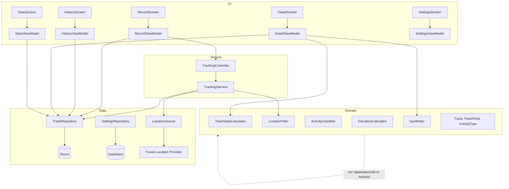
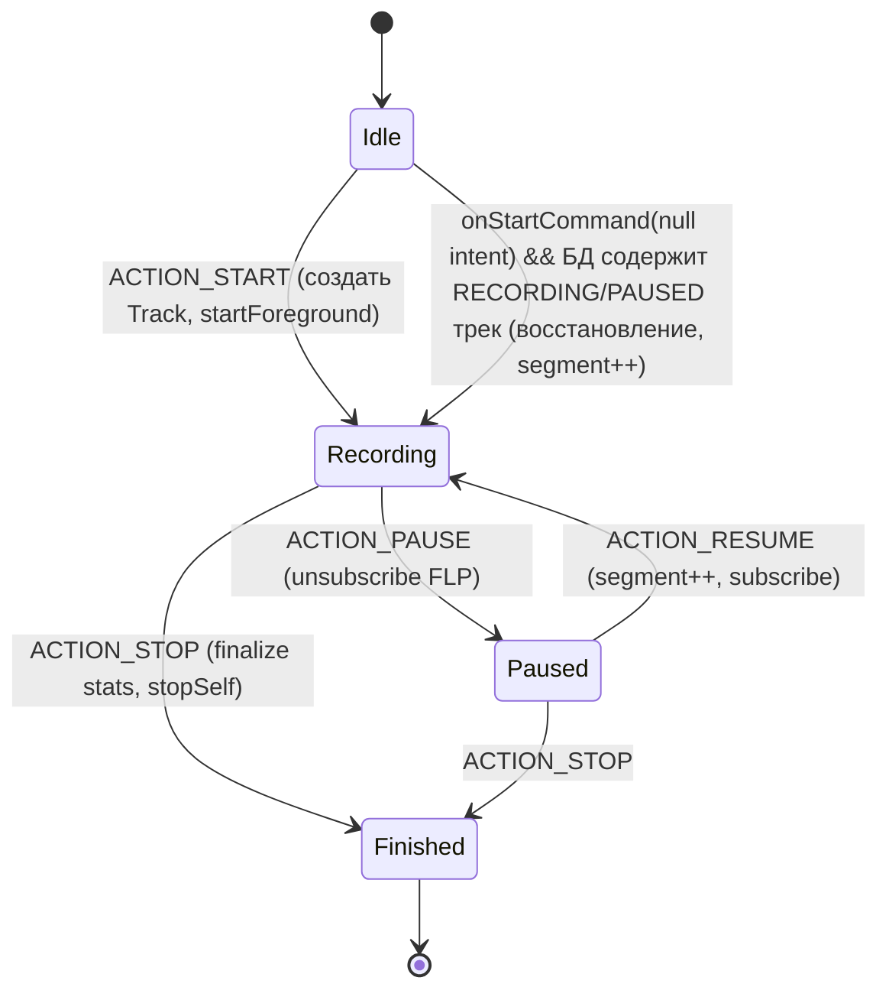
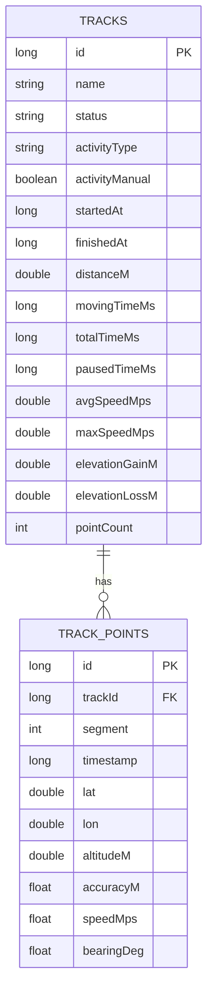
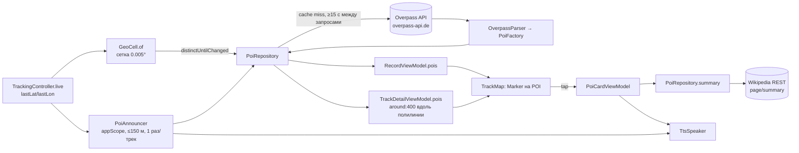

# TrekLog — архитектура (архитектор)

## 1. Стек и обоснование

| Компонент | Выбор | Обоснование |
|-----------|-------|-------------|
| Язык / UI | Kotlin 2.3 (встроенный в AGP 9), Jetpack Compose (Material 3, BOM 2026.09) | Стандарт Android, декларативный UI, быстрые итерации |
| Хранилище | Room 2.8 + Flow | Реактивные запросы, миграции, SQLite надёжна для 100k точек |
| Настройки | DataStore Preferences | Асинхронно, без SharedPreferences-гонок |
| Геолокация | Fused Location Provider (play-services-location) | Лучшая точность/батарея, объединяет GPS/сеть/сенсоры |
| Карта | **osmdroid** (OpenStreetMap) | Без API-ключа и биллинга, свободная лицензия, кэш тайлов из коробки. Google Maps SDK потребовал бы ключ, Cloud-проект и привязку карты; для MVP — лишняя зависимость. Можно заменить позже через абстракцию `MapContent` |
| Фоновая работа | Foreground Service (`foregroundServiceType="location"`) | Единственный поддерживаемый способ непрерывной записи GPS на Android 14+ без background-permission |
| DI | Ручной `AppContainer` | ~10 зависимостей; Hilt добавил бы kapt/ksp-время и сложность без выгоды (ADR-03) |
| Асинхронность | Coroutines + Flow | |
| Тесты | JUnit 4, kotlinx-coroutines-test, Room in-memory (Robolectric не нужен для домена) | |

## 2. Слои



Правила:
- `domain` — чистый Kotlin (без `android.*`), тестируется JVM-тестами.
- `data` знает про Room/DataStore/FLP, отдаёт доменные модели.
- `service` зависит от `data` и `domain`, не от `ui`.
- `ui` зависит от `domain`, `data` (через репозитории) и `service` (только `TrackingController`).
- **Single source of truth — БД.** Сервис пишет точки в Room; UI наблюдает `Flow` из Room. Никаких колбэков сервис→UI, никакого Binder-состояния: это делает UI устойчивым к пересозданию Activity и убийству процесса.

## 3. Структура пакетов

```
io.treklog.app
├── TrekLogApplication.kt        // создаёт AppContainer
├── di/AppContainer.kt
├── data/
│   ├── db/ (TrekLogDatabase, TrackDao, TrackEntity, TrackPointEntity, Converters)
│   ├── repo/ (TrackRepository, SettingsRepository)
│   ├── location/ (LocationSource, FusedLocationSource)
│   ├── poi/ (Http, OverpassParser, WikiSummaryParser, PoiRepository)   // 1.1
│   └── tts/ (TtsSpeaker)                                                // 1.1
├── domain/
│   ├── model/ (Track, TrackPoint, ActivityType, TrackStatus, TrackStats, UnitSystem)
│   ├── geo/ (Geo.kt — haversine, LocationFilter, ElevationCalculator)
│   ├── stats/ (TrackStatsCalculator)
│   ├── activity/ (ActivityClassifier)
│   ├── gpx/ (GpxWriter)
│   └── poi/ (Poi, WikipediaRef, GeoCell, OverpassQl, PoiFactory, PoiProximity)  // 1.1
├── service/ (TrackingService, TrackingController, TrackingNotification, PoiAnnouncer)
├── ui/
│   ├── MainActivity.kt, TrekLogApp.kt (NavHost + BottomBar)
│   ├── theme/
│   ├── common/ (StatTile, ActivityIcon, TrackMap, UnitFormatter, PermissionHelper)
│   ├── poi/ (PoiCard, PoiCardViewModel)                                  // 1.1
│   ├── onboarding/, record/, history/, detail/, stats/, settings/
└── util/ (AppLog, TimeFormat)
```

## 4. TrackingService



Ключевые решения:
- `startForegroundService()` вызывается только из UI (foreground-контекст), внутри `onStartCommand` — `startForeground(id, notification, FOREGROUND_SERVICE_TYPE_LOCATION)` в первые 5 с.
- `START_STICKY`; при перезапуске с `null`-intent сервис проверяет БД и восстанавливает запись.
- FLP: `LocationRequest.Builder(PRIORITY_HIGH_ACCURACY, 1000).setMinUpdateIntervalMillis(500).setMinUpdateDistanceMeters(0)`; колбэк на `Looper` сервиса; запись в БД через `serviceScope` (`SupervisorJob + Dispatchers.IO`).
- Уведомление (канал `tracking`, IMPORTANCE_LOW): текст «3.4 km · 00:18 · 12 km/h», действия Пауза/Продолжить и Стоп (PendingIntent на сервис), тап — открыть MainActivity.
- Инкрементальная статистика (`IncrementalStats`, in-memory) обновляется на каждой принятой точке и записывается в строку `Track` в одной транзакции со вставкой точки (`insertPointAndUpdateTrack`) — при 1 Гц это дёшево, а после смерти процесса сервис восстанавливает счётчики из строки трека без пересчёта всех точек. Полный пересчёт — только при завершении.
- Doze: FGS с типом location освобождён от ограничений на локацию; `WakeLock` не нужен (FLP держит GPS). Опционально пользователь может отключить оптимизацию батареи — в MVP не запрашиваем.

## 5. Модель данных (Room)


Индексы: `track_points(trackId, timestamp)`, `tracks(status)`, `tracks(startedAt)`. Версия схемы 1, `exportSchema = true` (каталог `schemas/` для будущих миграций).

## 6. Алгоритмы (реализация в domain)

- `Geo.distanceMeters(lat1, lon1, lat2, lon2)` — haversine.
- `LocationFilter.accept(prev, next, maxAccuracy)` — §3.1 спецификации; чистая функция, возвращает `FilterResult(accepted, reason)`.
- `TrackStatsCalculator.calculate(points, pausedTimeMs, finishedAt)` — полный пересчёт при завершении и в деталях; `IncrementalStats` — для сервиса.
- `ElevationCalculator.gainLoss(altitudes)` — скользящее среднее + гистерезис 3 м.
- `ActivityClassifier.classify(speeds)` — перцентили → тип.
- `GpxWriter.write(track, points, out: Appendable)` — GPX 1.1.

## 7. Карта

`TrackMap` — Compose-обёртка над `osmdroid.MapView` через `AndroidView`. Параметры: список сегментов (список списков `GeoPoint`), текущее положение, режим follow, колбэк `onUserGesture`, список `pois` + `onPoiClick`. Слои: `TilesOverlay` (Mapnik), `Polyline` на сегмент, `Marker` для положения/старт/финиш, `Marker` с иконкой `ic_poi_marker` на каждый POI (diff по id, маркер положения всегда сверху). Тайлы кэшируются osmdroid в `cacheDir/osmdroid` (не в external storage — без дополнительных разрешений). `User-Agent` = applicationId (требование политики OSM tile usage).

## 8. Экспорт GPX

`DetailViewModel.exportGpx()` → `GpxWriter` → файл в `cacheDir/exports` → `FileProvider` (`${applicationId}.fileprovider`, `cache-path exports/`) → `Intent.ACTION_SEND` с `FLAG_GRANT_READ_URI_PERMISSION`.

## 9. Стратегия тестирования

| Уровень | Что | Инструмент |
|---------|-----|------------|
| Unit (JVM) | Geo, LocationFilter, ElevationCalculator, TrackStatsCalculator, ActivityClassifier, GpxWriter, UnitFormatter | JUnit4 |
| Integration | TrackDao + TrackRepository | Room in-memory (androidTest) |
| UI | Навигация, состояния Record | Compose UI test (androidTest), в MVP — минимально |
| Ручное | Сервис при выключенном экране, kill процесса, отзыв разрешений | Эмулятор + `adb`, реальное устройство |

## 11. Интересное рядом (POI + TTS, релиз 1.1)



**Источник данных.** Overpass QL: `nwr["wikipedia"]["name"][!"boundary"][!"admin_level"](around:R, …); out center 200;` — только объекты со статьёй (гарантирует, что есть что прочитать) и именем; административные границы исключены. На экране записи запрос строится вокруг **центра ячейки сетки** (`GeoCell`, 0.005° ≈ 550 м), R = 1500 м; в деталях — вокруг упрощённой полилинии трека (≤ 80 вершин, 4 знака после запятой), R = 400 м.

**Описание.** Wikipedia REST `GET https://{lang}.wikipedia.org/api/rest_v1/page/summary/{title}` → поле `extract` (лид-секция, plain text), `lang`, `content_urls.mobile.page`. Язык и заголовок берутся из тега `wikipedia:<язык устройства>`, иначе `wikipedia`; `lang` валидируется регулярным выражением `^[a-z]{2,3}(-[a-z]{2,10})?$` до подстановки в hostname.

**Кэш и вежливость к публичным серверам** (`PoiRepository`): LRU 32 ячейки / 8 треков, TTL 30 мин; описания — LRU 64 на время жизни процесса; запросы к Overpass сериализованы `Mutex`, интервал ≥ 15 с, после любой ошибки (429/504/офлайн) — пауза 60 с. `mapLatest` во ViewModel отменяет запрос при смене ячейки.

**TTS.** `TtsSpeaker` (process-wide, в `AppContainer`): `TextToSpeech` + `UtteranceProgressListener` → `StateFlow<speakingId>`; аудиофокус `AUDIOFOCUS_GAIN_TRANSIENT_MAY_DUCK` c `USAGE_ASSISTANCE_NAVIGATION_GUIDANCE`. Ручное чтение — `QUEUE_FLUSH`, авто-объявления — `QUEUE_ADD`. Требуется `<queries><intent action=TTS_SERVICE>` (package visibility, Android 11+).

**Авто-озвучка.** `PoiAnnouncer` живёт в `appScope`, а не во ViewModel: подписан на `settingsFlow` × `trackingController.live`, активен только при `poiEnabled && poiAutoSpeak && serviceRunning`. Использует кэш ячейки (при промахе — одиночный запрос), `PoiProximity.nextToAnnounce` (≤ 150 м, ближайший, не объявленный), множество объявленных сбрасывается при старте новой записи. Работает при выключенном экране, пока FGS держит процесс; в Doze (устройство неподвижно) сеть может быть отложена — в этом случае объект будет объявлен при следующем фиксе.

## 10. ADR

**ADR-01. osmdroid вместо Google Maps SDK.** Контекст: MVP без бэкенда и биллинга. Решение: osmdroid. Последствия: нет спутникового слоя и Google-стиля; зато нет ключей, квот и Cloud-проекта. Обёртка `TrackMap` изолирует замену.

**ADR-02. Foreground Service вместо WorkManager/`ACCESS_BACKGROUND_LOCATION`.** WorkManager не даёт секундного интервала; background-permission требует отдельной декларации и часто отклоняется. FGS с типом `location` работает при выключенном экране, пока пользователь явно запустил запись.

**ADR-03. Ручной DI.** Один модуль, ~10 объектов. Hilt увеличит время сборки и порог входа. При росте до 3+ модулей — пересмотреть.

**ADR-04. БД как единственный источник истины между сервисом и UI.** Убирает класс ошибок с Binder-жизненным циклом и восстановлением после смерти процесса.

**ADR-05. Хранение точек в СИ, конвертация в UI.** Упрощает алгоритмы и тесты; единицы — чисто презентационное решение.

**ADR-06. Без шифрования БД в MVP.** Данные в приватном каталоге приложения, защищены песочницей ОС; `allowBackup=false` исключает утечку через облачный бэкап. SQLCipher добавляет 5+ МБ и усложняет Room; отложено (см. `07_security.md`).

**ADR-07. Overpass + Wikipedia REST вместо единого Wikipedia GeoSearch.** Контекст: нужны объекты «вокруг трека», а не вокруг точки. Overpass поддерживает `around` вдоль полилинии и даёт категорию (теги OSM) и локализованные имена; Wikipedia REST `page/summary` отдаёт готовый plain-text лид без парсинга wikitext. Последствия: два публичных сервера с лимитами — обязательны кэш, интервалы и backoff; при недоступности функция тихо деградирует.

**ADR-08. HttpURLConnection + org.json вместо OkHttp/Retrofit/Moshi.** Два GET/POST-эндпоинта не оправдывают +1,5 МБ и новые ProGuard-правила (NFR-03). Для JVM-тестов парсеров подключён реальный `org.json:json` (стаб Android SDK бросает «not mocked»).

**ADR-09. Привязка запроса к сетке 0.005°.** Точное положение пользователя не покидает устройство: Overpass получает центр ячейки ≈ 550 м; радиус 1500 м гарантирует покрытие ≥ 1,2 км вокруг реального положения. Побочный эффект — один запрос на ячейку (кэш), что также снижает нагрузку на сервер.

**ADR-10. PoiAnnouncer в application scope, а не в ViewModel/сервисе.** ViewModel умирает с back stack; встраивание в `TrackingService` смешало бы запись с сетью/TTS. Отдельный объект, подписанный на те же потоки, что и UI, при выключенном экране живёт благодаря FGS. Пересмотреть, если появится требование гарантированной озвучки в Doze (тогда — внутрь сервиса с wakelock на время запроса).
