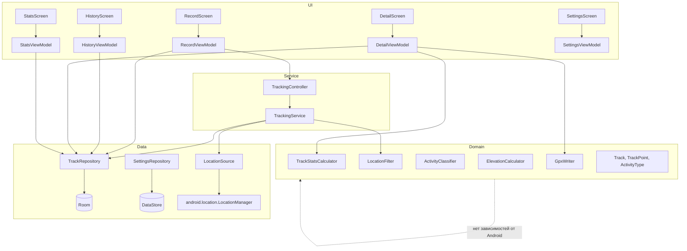
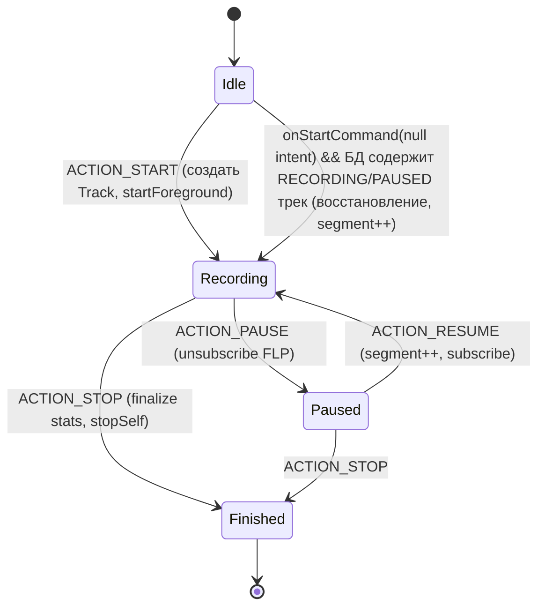
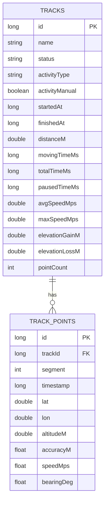
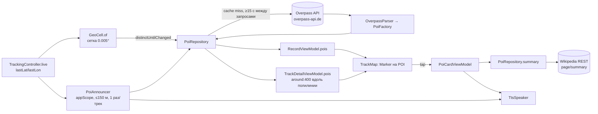
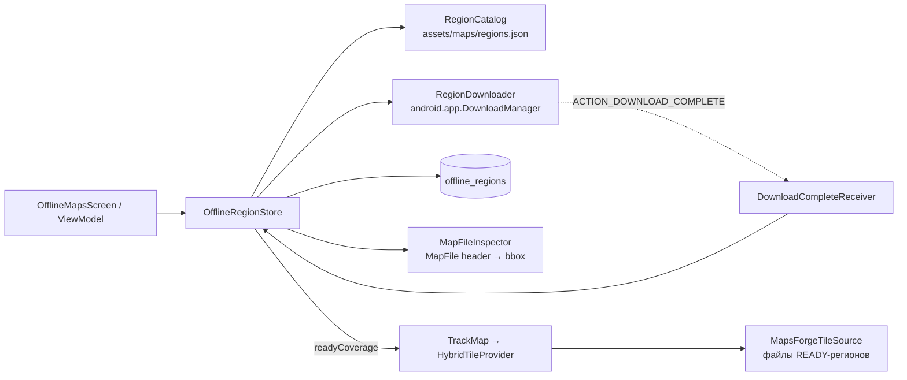

# JustTracker — архитектура (архитектор)

## 1. Стек и обоснование

| Компонент | Выбор | Обоснование |
|-----------|-------|-------------|
| Язык / UI | Kotlin 2.3 (встроенный в AGP 9), Jetpack Compose (Material 3, BOM 2026.09) | Стандарт Android, декларативный UI, быстрые итерации |
| Хранилище | Room 2.8 + Flow | Реактивные запросы, миграции, SQLite надёжна для 100k точек |
| Настройки | DataStore Preferences | Асинхронно, без SharedPreferences-гонок |
| Геолокация | **Платформенный `LocationManager`** через `LocationManagerCompat` (без GMS) | Работа на устройствах без Google-сервисов (RuStore-аудитория, Huawei/Honor, AOSP); на Android 12+ используется системный fused-провайдер, ниже — GPS. ADR-14 |
| Карта | **osmdroid** (OpenStreetMap) + **osmdroid-mapsforge** (офлайн-регионы) | Без API-ключа и биллинга, свободная лицензия, кэш тайлов из коробки. Офлайн — векторные `.map`-файлы Mapsforge, скачиваемые по регионам (ADR-13): массовая загрузка растровых тайлов OSM запрещена политикой OSMF. Google Maps SDK потребовал бы ключ, Cloud-проект и GMS |
| Локаль | AppCompat per-app locales (`AppCompatActivity`, `AppLocalesMetadataHolderService`) | Явный выбор языка ru/en, сохраняется на API 26–32 силами AppCompat, на 33+ — системным LocaleManager. ADR-15 |
| Фоновая работа | Foreground Service (`foregroundServiceType="location"`) | Единственный поддерживаемый способ непрерывной записи GPS на Android 14+ без background-permission |
| DI | Ручной `AppContainer` | ~10 зависимостей; Hilt добавил бы kapt/ksp-время и сложность без выгоды (ADR-03) |
| Асинхронность | Coroutines + Flow | |
| Тесты | JUnit 4, kotlinx-coroutines-test, Room in-memory (Robolectric не нужен для домена) | |

## 2. Слои



Правила:
- `domain` — чистый Kotlin (без `android.*`), тестируется JVM-тестами.
- `data` знает про Room/DataStore/FLP, отдаёт доменные модели.
- `service` зависит от `data` и `domain`, не от `ui`.
- `ui` зависит от `domain`, `data` (через репозитории) и `service` (только `TrackingController`).
- **Single source of truth — БД.** Сервис пишет точки в Room; UI наблюдает `Flow` из Room. Никаких колбэков сервис→UI, никакого Binder-состояния: это делает UI устойчивым к пересозданию Activity и убийству процесса.

## 3. Структура пакетов

```
com.justtracker.app
├── JustTrackerApplication.kt        // создаёт AppContainer
├── di/AppContainer.kt
├── data/
│   ├── db/ (JustTrackerDatabase, TrackDao, TrackEntity, TrackPointEntity, OfflineRegionEntity + Dao)
│   ├── repo/ (TrackRepository, SettingsRepository)
│   ├── location/ (LocationSource, PlatformLocationSource, ProviderPolicy)
│   ├── maps/ (RegionCatalog + Parser, MapsDirectory, MapFileInspector, RegionDownloader + DownloadCompleteReceiver, OfflineRegionStore, MapModeController)
│   ├── network/ (ConnectivityObserver)
│   │   └── render/ (HybridTileProvider, OfflineRegionModule)
│   ├── poi/ (Http, OverpassParser, WikiSummaryParser, PoiRepository)   // 1.1
│   └── tts/ (TtsSpeaker)                                                // 1.1
├── domain/
│   ├── model/ (Track, TrackPoint, ActivityType, TrackStatus, TrackStats, UnitSystem, AppLanguage, AppSettings)
│   ├── maps/ (LatLonBox, RegionCoverage, MapSource + MapSourceResolver, OfflineRegion, RegionStatus/Error/Source/Event, RegionTransitions)
│   ├── geo/ (Geo.kt — haversine, LocationFilter, ElevationCalculator)
│   ├── stats/ (TrackStatsCalculator)
│   ├── activity/ (ActivityClassifier)
│   ├── gpx/ (GpxWriter)
│   └── poi/ (Poi, WikipediaRef, GeoCell, OverpassQl, PoiFactory, PoiProximity)  // 1.1
├── service/ (TrackingService, TrackingController, TrackingNotification, PoiAnnouncer)
├── ui/
│   ├── MainActivity.kt (AppCompatActivity, splash), JustTrackerApp.kt (NavigationSuiteScaffold + NavHost)
│   ├── theme/ (Theme.kt, Type.kt, Shape.kt)
│   ├── maps/ (OfflineMapsScreen, OfflineMapsViewModel)
│   ├── common/ (StatTile, ActivityIcon, TrackMap, UnitFormatter, PermissionHelper)
│   ├── poi/ (PoiCard, PoiCardViewModel)                                  // 1.1
│   ├── onboarding/, record/, history/, detail/, stats/, settings/
└── util/ (AppLog, TimeFormat, AppLocale, UnitFormatter)
```

## 4. TrackingService



Ключевые решения:
- `startForegroundService()` вызывается только из UI (foreground-контекст), внутри `onStartCommand` — `startForeground(id, notification, FOREGROUND_SERVICE_TYPE_LOCATION)` в первые 5 с.
- `START_STICKY`; при перезапуске с `null`-intent сервис проверяет БД и восстанавливает запись.
- Геолокация: `PlatformLocationSource` — `LocationRequestCompat.Builder(1000).setQuality(QUALITY_HIGH_ACCURACY).setMinUpdateIntervalMillis(500).setMinUpdateDistanceMeters(0)`, провайдер по `ProviderPolicy` (`fused` на API 31+ → `gps` → `network`), колбэк на main executor; `SecurityException` закрывает flow — сервис реагирует как раньше. Запись в БД через `serviceScope`.
- Локаль сервиса: строки (автоимя, уведомление) и `UnitFormatter` берутся из `AppLocale.localized(this, cachedSettings)` — на API < 33 контекст Service следует системной локали, а не выбранной в приложении.
- Уведомление (канал `tracking`, IMPORTANCE_LOW): текст «3.4 km · 12 km/h», время записи — системный хронометр (`setUsesChronometer(true)`, `setWhen(startedAt)`), который тикает без обновлений уведомления; действия Пауза/Продолжить и Стоп (PendingIntent на сервис), тап — открыть MainActivity.
- Инкрементальная статистика (`IncrementalStats`, in-memory) обновляется на каждой принятой точке и записывается в строку `Track` в одной транзакции со вставкой точки (`insertPointAndUpdateTrack`) — при 1 Гц это дёшево, а после смерти процесса сервис восстанавливает счётчики из строки трека без пересчёта всех точек. Полный пересчёт — только при завершении.
- Doze: FGS с типом location освобождён от ограничений на локацию; `WakeLock` не нужен (FLP держит GPS). Опционально пользователь может отключить оптимизацию батареи — в MVP не запрашиваем.

## 5. Модель данных (Room)


Индексы: `track_points(trackId, timestamp)`, `tracks(status)`, `tracks(startedAt)`. Версия схемы 1, `exportSchema = true` (каталог `schemas/` для будущих миграций).

**Время записи** (1.2) — производная величина `Track.recordingTimeMs(now) = (finishedAt ?: now) − startedAt`, не хранится: старые строки корректны без миграции. `totalTimeMs` (время записи без пауз) и `pausedTimeMs` сохраняются как есть. **Скорость по участкам** — `track_points.speedMps` каждой точки (`effectiveSpeed` на момент записи), сглаживается при отображении (`SpeedProfile`).

## 6. Алгоритмы (реализация в domain)

- `Geo.distanceMeters(lat1, lon1, lat2, lon2)` — haversine.
- `LocationFilter.accept(prev, next, maxAccuracy)` — §3.1 спецификации; чистая функция, возвращает `FilterResult(accepted, reason)`.
- `TrackStatsCalculator.calculate(points, pausedTimeMs, finishedAt)` — полный пересчёт при завершении и в деталях; `IncrementalStats` — для сервиса.
- `SpeedProfile.of(points)` — попточечно: сглаженная скорость (та же `smoothedSpeeds`, что и для макс. скорости), накопленная дистанция, timestamp и высота; основа для окраски линии, карточки «Скорость на участке» и курсора по треку в деталях.
- `ElevationCalculator.gainLoss(altitudes)` — скользящее среднее + гистерезис 3 м.
- `ActivityClassifier.classify(speeds)` — перцентили → тип.
- `GpxWriter.write(track, points, out: Appendable)` — GPX 1.1.

## 7. Карта

`TrackMap` — Compose-обёртка над `osmdroid.MapView` через `AndroidView`. Параметры: список сегментов `PathSegment` (вершины + параллельные массивы скорости/дистанции/времени, собираются `TrackPath.build` на `Dispatchers.Default`), `maxSpeedMps` (верх шкалы цвета), текущее положение, `highlight` (тапнутая вершина), режим follow, колбэки `onUserGesture` и `onTrackTap(segment, index)`, список `pois` + `onPoiClick`. Слои: `TilesOverlay` (Mapnik), `Polyline` на сегмент с `PolychromaticPaintList` (цвет вершины из `SpeedColorScale`; массив скоростей и максимум подменяются на месте, поэтому рост live-трека и максимума не требуют пересоздания оверлея), `Marker` для положения/старт/финиш/выделения, `Marker` с иконкой `ic_poi_marker` на каждый POI (diff по id, маркер положения всегда сверху). Тап по линии → ближайшая вершина (equirectangular) → ViewModel разрешает её в `TrackTapInfo` (экран записи: карточка с авто-скрытием) или переносит курсор `TrackCursor` (детали: слайдер по дистанции, `TrackPath.indexForFraction` / `cursorAt` — глобальный индекс вершины по всем сегментам; скорость, расстояние, время с начала записи, время суток, высота). Онлайн-тайлы кэшируются osmdroid в `cacheDir/osmdroid` (не в external storage — без дополнительных разрешений). `User-Agent` = applicationId (требование политики OSM tile usage).

**Провайдер тайлов** — `HybridTileProvider : MapTileProviderBasic` (§12, ADR-16). Наследуется от штатного провайдера osmdroid (кэш → архивы → аппроксимация → загрузчик MAPNIK со стандартной настройкой защиты LRU-кэша и pre-cache): «голый» `MapTileProviderArray` без этой настройки вытеснял тайлы до отрисовки и скачивал их по кругу — карта при запуске оставалась пустой (D-09). По режиму карты (`AppSettings.mapMode`): **ONLINE** — цепочка как есть, регионы не используются; **OFFLINE** — в начало цепочки вставляется `OfflineRegionModule` (Mapsforge, только тайлы внутри READY-регионов, зум ≥ 8) и вызывается `setUseDataConnection(false)`, поэтому непокрытые тайлы берутся лишь из кэша/аппроксимации. `TrackMap` пересобирает провайдер в `DisposableEffect(mapMode, offlineFiles, language, dark)`; `MapView.setTileProvider` создаёт новый `TilesOverlay`, поэтому фильтр `INVERT_COLORS` применяется повторно. Тёмная тема карты — по теме приложения (`colorScheme.background.luminance()`), а не только по системной.

## 8. Экспорт GPX

`DetailViewModel.exportGpx()` → `GpxWriter` → файл в `cacheDir/exports` → `FileProvider` (`${applicationId}.fileprovider`, `cache-path exports/`) → `Intent.ACTION_SEND` с `FLAG_GRANT_READ_URI_PERMISSION`.

## 9. Стратегия тестирования

| Уровень | Что | Инструмент |
|---------|-----|------------|
| Unit (JVM) | Geo, LocationFilter, ElevationCalculator, TrackStatsCalculator, SpeedProfile/TrackPath, SpeedColorScale, Track.recordingTimeMs, ActivityClassifier, GpxWriter, UnitFormatter | JUnit4 |
| Unit (JVM), JustTracker | ProviderPolicy, AppLanguage, LatLonBox (ofTile), MapSourceResolver, RegionTransitions, DownloadManager reason → RegionError, RegionCatalogParser (+ валидность `assets/maps/regions.json`) | JUnit4 |
| Integration | TrackDao + TrackRepository, OfflineRegionDao | Room in-memory (androidTest) |
| UI | Навигация, состояния Record | Compose UI test (androidTest), в MVP — минимально |
| Ручное | Сервис при выключенном экране, kill процесса, отзыв разрешений; загрузка/импорт региона, рендер в авиарежиме; смена языка на API 26–32 и 33+; образ без Google APIs | Эмулятор + `adb`, реальное устройство |

## 11. Интересное рядом (POI + TTS, релиз 1.1)



**Источник данных.** Overpass QL: `nwr["wikipedia"]["name"][!"boundary"][!"admin_level"](around:R, …); out center 200;` — только объекты со статьёй (гарантирует, что есть что прочитать) и именем; административные границы исключены. На экране записи запрос строится вокруг **центра ячейки сетки** (`GeoCell`, 0.005° ≈ 550 м), R = 1500 м; в деталях — вокруг упрощённой полилинии трека (≤ 80 вершин, 4 знака после запятой), R = 400 м.

**Описание.** Wikipedia REST `GET https://{lang}.wikipedia.org/api/rest_v1/page/summary/{title}` → поле `extract` (лид-секция, plain text), `lang`, `content_urls.mobile.page`. Язык и заголовок берутся из тега `wikipedia:<язык устройства>`, иначе `wikipedia`; `lang` валидируется регулярным выражением `^[a-z]{2,3}(-[a-z]{2,10})?$` до подстановки в hostname.

**Кэш и вежливость к публичным серверам** (`PoiRepository`): LRU 32 ячейки / 8 треков, TTL 30 мин; описания — LRU 64 на время жизни процесса; запросы к Overpass сериализованы `Mutex`, интервал ≥ 15 с, после любой ошибки (429/504/офлайн) — пауза 60 с. `mapLatest` во ViewModel отменяет запрос при смене ячейки.

**TTS.** `TtsSpeaker` (process-wide, в `AppContainer`): `TextToSpeech` + `UtteranceProgressListener` → `StateFlow<speakingId>`; аудиофокус `AUDIOFOCUS_GAIN_TRANSIENT_MAY_DUCK` c `USAGE_ASSISTANCE_NAVIGATION_GUIDANCE`. Ручное чтение — `QUEUE_FLUSH`, авто-объявления — `QUEUE_ADD`. Требуется `<queries><intent action=TTS_SERVICE>` (package visibility, Android 11+).

**Авто-озвучка.** `PoiAnnouncer` живёт в `appScope`, а не во ViewModel: подписан на `settingsFlow` × `trackingController.live`, активен только при `poiEnabled && poiAutoSpeak && serviceRunning`. Использует кэш ячейки (при промахе — одиночный запрос), `PoiProximity.nextToAnnounce` (≤ 150 м, ближайший, не объявленный), множество объявленных сбрасывается при старте новой записи. Работает при выключенном экране, пока FGS держит процесс; в Doze (устройство неподвижно) сеть может быть отложена — в этом случае объект будет объявлен при следующем фиксе.

## 12. Офлайн-регионы (JustTracker 1.0.0)



**Каталог.** `assets/maps/regions.json` — id, имена ru/en, https-URL на `download.mapsforge.org`, размер, приблизительный bbox. Парсер отбрасывает всё, что не https и не на разрешённом хосте (`RegionCatalogParser.ALLOWED_HOSTS`), и дубли id. Bbox из каталога — только для отображения; после загрузки границы берутся из заголовка файла.

**Хранение.** Файлы — `context.getExternalFilesDir("maps")` (единственное место, куда пишет DownloadManager; без разрешений; удаляется с приложением; исключено из backup). Без внешнего хранилища — `filesDir/maps` и только импорт. Строка в Room-таблице `offline_regions` (id, имена, fileName, size, bbox, source CATALOG|IMPORT, status, downloadId, errorReason, updatedAt).

**State machine** (`RegionTransitions`, чистая функция, тест):
```
(absent) --download--> QUEUED --running--> DOWNLOADING --success--> VERIFYING --header ok--> READY
QUEUED/DOWNLOADING --failed--> ERROR ; --cancel--> (absent)      VERIFYING --corrupt--> ERROR
ERROR --retry--> QUEUED       READY --delete--> (absent)          (absent) --import--> VERIFYING --ok--> READY
```
DownloadManager сам докачивает, ждёт Wi-Fi (`NETWORK_WIFI`, `setAllowedOverMetered(false)`) и показывает уведомление; прогресс опрашивается (`query()`) раз в секунду, пока есть активные строки; завершение приходит через manifest-receiver (работает и при мёртвом процессе). `reconcile()` при старте: READY без файла → удалить; QUEUED/DOWNLOADING без загрузки в DM → ERROR(LOST); VERIFYING → проверить; `.map` без строки → принять как IMPORT; `.part` без строки → удалить. Перед загрузкой — проверка свободного места (размер + 200 МБ).

**Режим карты и связность.** `ConnectivityObserver` (`data/network`) держит `StateFlow<Boolean> online` из `registerDefaultNetworkCallback` по аргументам колбэков (`onCapabilitiesChanged` → INTERNET+VALIDATED, `onLost` → false; `activeNetwork` в момент `onLost` ещё может указывать на исчезающую сеть). `MapModeController` (`data/maps`) объединяет режим из DataStore (`map_mode`), `online` и наличие READY-регионов через чистый `MapModeAdvisor.suggest(mode, online, hasRegions, declinedFor)` → `StateFlow<MapModeSuggestion?>`; `JustTrackerApp` показывает по нему `MapModePromptDialog`. Режим меняется только через `setMode` (диалог настроек `MapModeDialog` или подтверждение окна); `dismissSuggestion()` запоминает состояние сети, для которого пользователь отказался, — окно молчит до следующего изменения связности.

**Рендер.** `MapsForgeTileSource.createFromFiles(files, theme=null, "JustTrackerOffline", language)` над всеми READY-файлами (`MultiMapDataStore`), `MapsForgeTileSource.createInstance(app)` один раз в `Application`. `OfflineRegionModule.loadTile` возвращает `null` для тайлов вне покрытия (`MapSourceResolver.resolveForTile`, `MIN_OFFLINE_ZOOM = 8`), и `MapTileProviderArray` спрашивает следующий модуль. Рендер на диск не пишется (in-memory LRU osmdroid достаточно; удаление региона не оставляет «призрачных» тайлов). Известное ограничение: тайлы 256 px масштабируются по DPI, как и онлайн-тайлы, — крупные подписи на плотных экранах.

## 10. ADR

**ADR-01. osmdroid вместо Google Maps SDK.** Контекст: MVP без бэкенда и биллинга. Решение: osmdroid. Последствия: нет спутникового слоя и Google-стиля; зато нет ключей, квот и Cloud-проекта. Обёртка `TrackMap` изолирует замену.

**ADR-02. Foreground Service вместо WorkManager/`ACCESS_BACKGROUND_LOCATION`.** WorkManager не даёт секундного интервала; background-permission требует отдельной декларации и часто отклоняется. FGS с типом `location` работает при выключенном экране, пока пользователь явно запустил запись.

**ADR-03. Ручной DI.** Один модуль, ~10 объектов. Hilt увеличит время сборки и порог входа. При росте до 3+ модулей — пересмотреть.

**ADR-04. БД как единственный источник истины между сервисом и UI.** Убирает класс ошибок с Binder-жизненным циклом и восстановлением после смерти процесса.

**ADR-05. Хранение точек в СИ, конвертация в UI.** Упрощает алгоритмы и тесты; единицы — чисто презентационное решение.

**ADR-06. Без шифрования БД в MVP.** Данные в приватном каталоге приложения, защищены песочницей ОС; `allowBackup=false` исключает утечку через облачный бэкап. SQLCipher добавляет 5+ МБ и усложняет Room; отложено (см. `07_security.md`).

**ADR-07. Overpass + Wikipedia REST вместо единого Wikipedia GeoSearch.** Контекст: нужны объекты «вокруг трека», а не вокруг точки. Overpass поддерживает `around` вдоль полилинии и даёт категорию (теги OSM) и локализованные имена; Wikipedia REST `page/summary` отдаёт готовый plain-text лид без парсинга wikitext. Последствия: два публичных сервера с лимитами — обязательны кэш, интервалы и backoff; при недоступности функция тихо деградирует.

**ADR-08. HttpURLConnection + org.json вместо OkHttp/Retrofit/Moshi.** Два GET/POST-эндпоинта не оправдывают +1,5 МБ и новые ProGuard-правила (NFR-03). Для JVM-тестов парсеров подключён реальный `org.json:json` (стаб Android SDK бросает «not mocked»).

**ADR-09. Привязка запроса к сетке 0.005°.** Точное положение пользователя не покидает устройство: Overpass получает центр ячейки ≈ 550 м; радиус 1500 м гарантирует покрытие ≥ 1,2 км вокруг реального положения. Побочный эффект — один запрос на ячейку (кэш), что также снижает нагрузку на сервер.

**ADR-11. Время записи — производная, а не новая колонка.** Контекст: основным временем становится интервал «Старт → Стоп» с паузами. Хранить его отдельно — дублировать `startedAt`/`finishedAt` и требовать миграцию с обратным заполнением. Решение: `Track.recordingTimeMs(now)` вычисляется из существующих полей; `totalTimeMs` (без пауз) остаётся в схеме для совместимости и возможного отображения. Последствия: нет миграции, старая история корректна; live-значение тикает по тикеру UI, а не по точкам GPS.

**ADR-12. Окраска линии через `PolychromaticPaintList`, а не набор полилиний.** Контекст: нужна скорость по участкам на live-карте до 100 000 точек. Отдельная `Polyline` на участок — тысячи оверлеев и пересоздание при каждом обновлении. Решение: одна `Polyline` на сегмент с `ColorMapping` по индексу вершины; сглаженные скорости считаются в `SpeedProfile` на `Dispatchers.Default` (O(n) на эмиссию, 1 Гц). Градиент между вершинами выключен (`useGradient=false`) — избегаем аллокации `LinearGradient` на каждый отрезок в каждом кадре.

**ADR-13. Офлайн-карты — файлы регионов Mapsforge, а не кэш растровых тайлов.** Контекст: политика OSMF прямо запрещает «download city/country for offline» с `tile.openstreetmap.org`; osmdroid `CacheManager` бросает `TileSourcePolicyException` для MAPNIK. Альтернативы: платный тайл-провайдер (Thunderforest Small Business+), свой тайл-сервер, MapLibre + собственные PMTiles-выгрузки (нужен хостинг). Решение: `osmdroid-mapsforge` + готовые региональные `.map` с `download.mapsforge.org` (ODbL) — один HTTP-файл на регион, без ключей, серверов и юридических рисков; онлайн-режим остаётся MAPNIK с обычным кэшем. Последствия: файлы 0,03–1,8 ГБ (Wi-Fi only, контроль места), CPU-рендер на устройстве (обзорные зумы < 8 — онлайн), зависимость от одного зеркала (обход — импорт своего файла), mapsforge 0.21 в транзитивных зависимостях (Plan B — копия трёх классов osmdroid-mapsforge при несовместимости).

**ADR-14. Платформенный LocationManager вместо Fused Location Provider (GMS).** Контекст: ценность «автономность», аудитория RuStore включает устройства без Google-сервисов, на которых `FusedLocationProviderClient` не работает. Решение: `PlatformLocationSource` на `LocationManagerCompat` (core-ktx), провайдер `fused` (AOSP, API 31+) → `gps` → `network`; интерфейс `LocationSource` не изменился, сервис не тронут. Последствия: удалены `play-services-location` и `kotlinx-coroutines-play-services` (−GMS, −размер); на старых устройствах без AOSP-fused первый фикс медленнее (только GPS) — приемлемо для трекера, который и так пишет GPS.

**ADR-15. Per-app locale через AppCompat + дублирование выбора в DataStore.** Контекст: язык должен выбираться явно и работать на API 26+. `AppCompatDelegate.setApplicationLocales` — единственный официальный backport (на 33+ делегирует системному LocaleManager), но требует `AppCompatActivity` и AppCompat-тему, а на API 26–32 меняет локаль только activity-контекстов. Решение: выбор хранится в DataStore (`language`) как источник истины; `AppLocale` синхронизирует AppCompat (`sync`), держит `Locale.getDefault()` (`applyDefault`) и даёт локализованный контекст сервису (`localized`). Последствия: `MainActivity : AppCompatActivity`, тема `Theme.AppCompat.DayNight.NoActionBar`, `locales_config.xml`, `AppLocalesMetadataHolderService`; activity пересоздаётся при смене языка; варианта «системный» нет по продуктовому решению.

**ADR-16. Явный режим карты вместо неявной гибридной маршрутизации.** Контекст: первая версия выбирала источник по тайлу автоматически (регион → кэш → сеть), пользователь не знал и не управлял тем, откуда карта; требование продукта — явное переключение онлайн/офлайн в настройках и по подтверждению при потере/возврате сети. Решение: `MapMode {ONLINE, OFFLINE}` в DataStore как единственный источник истины; провайдер строится по режиму (`HybridTileProvider.create(mode)`); связность только *предлагает* смену через окно, никогда не переключает сама; в OFFLINE сеть для карты выключена (`setUseDataConnection(false)`). Побочный результат: провайдер переведён на `MapTileProviderBasic`, что устранило бесконечную перезагрузку тайлов при старте. Последствия: в ONLINE регионы не используются даже без сети до подтверждения; окно при потере сети не показывается, если регионов нет; POI-функция от режима не зависит.

**ADR-10. PoiAnnouncer в application scope, а не в ViewModel/сервисе.** ViewModel умирает с back stack; встраивание в `TrackingService` смешало бы запись с сетью/TTS. Отдельный объект, подписанный на те же потоки, что и UI, при выключенном экране живёт благодаря FGS. Пересмотреть, если появится требование гарантированной озвучки в Doze (тогда — внутрь сервиса с wakelock на время запроса).
