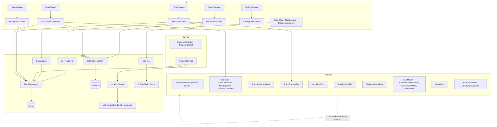
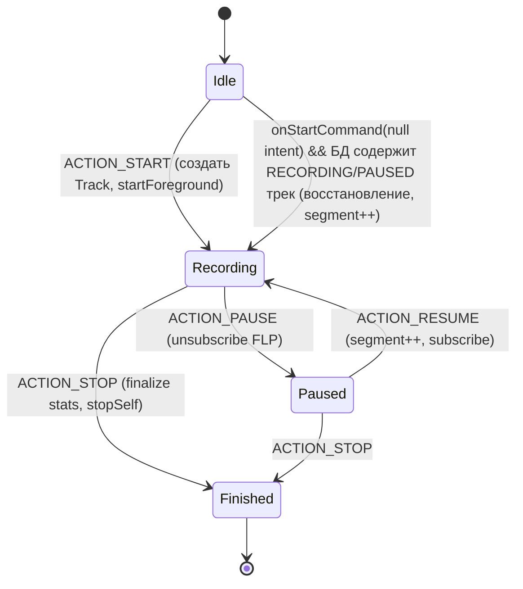
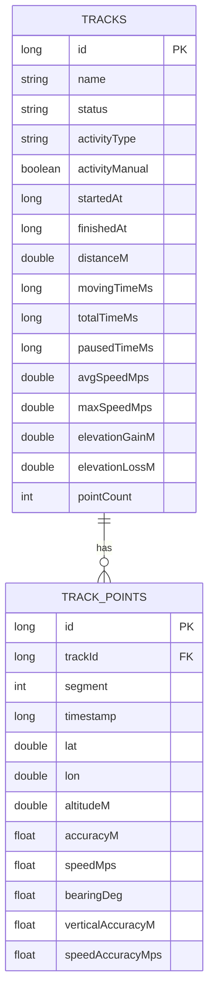
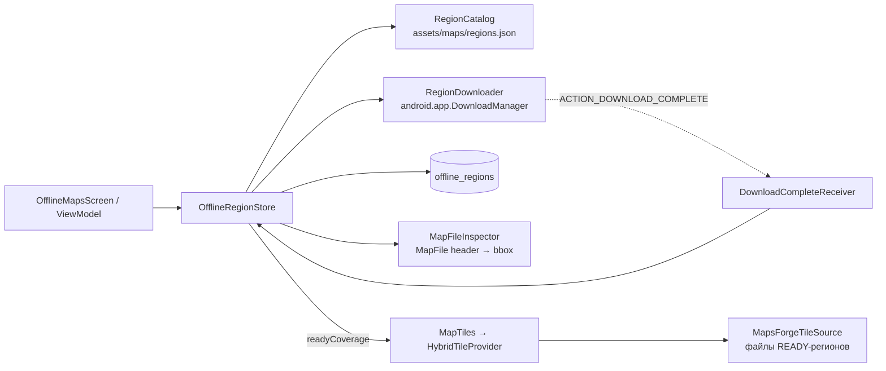

# JustTracker — архитектура (архитектор)

## 1. Стек и обоснование

| Компонент | Выбор | Обоснование |
|-----------|-------|-------------|
| Язык / UI | Kotlin 2.3 (встроенный в AGP 9), Jetpack Compose (Material 3, BOM 2026.09) | Стандарт Android, декларативный UI, быстрые итерации |
| Хранилище | Room 2.8 + Flow | Реактивные запросы, миграции, SQLite надёжна для 100k точек |
| Настройки | DataStore Preferences | Асинхронно, без SharedPreferences-гонок |
| Геолокация | **Платформенный `LocationManager`** через `LocationManagerCompat` (без GMS) | Работа на устройствах без Google-сервисов (RuStore-аудитория, Huawei/Honor, AOSP); на Android 12+ используется системный fused-провайдер, ниже — GPS. ADR-14 |
| Карта | **osmdroid** (OpenStreetMap) + **Mapsforge 0.21** напрямую (`mapsforge-map-android`, `mapsforge-map`, `mapsforge-themes`; офлайн-регионы) | Без API-ключа и биллинга, свободная лицензия, кэш тайлов из коробки. Офлайн — векторные `.map`-файлы Mapsforge, скачиваемые по регионам (ADR-13): массовая загрузка растровых тайлов OSM запрещена политикой OSMF. Рендер тайлов — собственный многопоточный (`OfflineRenderer`, ADR-17) вместо однопоточного `osmdroid-mapsforge`. Google Maps SDK потребовал бы ключ, Cloud-проект и GMS |
| Локаль | AppCompat per-app locales (`AppCompatActivity`, `AppLocalesMetadataHolderService`) | Явный выбор языка ru/en, сохраняется на API 26–32 силами AppCompat, на 33+ — системным LocaleManager. ADR-15 |
| Фоновая работа | Foreground Service (`foregroundServiceType="location"`) | Единственный поддерживаемый способ непрерывной записи GPS на Android 14+ без background-permission |
| DI | Ручной `AppContainer`; ViewModel получают только свои зависимости (ADR-28) | ~10 зависимостей; Hilt добавил бы kapt/ksp-время и сложность без выгоды (ADR-03) |
| Асинхронность | Coroutines + Flow | |
| Тесты | JUnit 4, kotlinx-coroutines-test, фейки в памяти (`FakeTrackDao`, `FakeTrackingControl`); Room in-memory и `MigrationTestHelper` (androidTest) | Robolectric не нужен: домен и ViewModel тестируются на JVM, слои — `ArchitectureTest` (ADR-28) |
| Производительность | Baseline Profile (`profileinstaller`, модуль `:baselineprofile`), Macrobenchmark; секции `android.os.Trace` (`traced`), StrictMode в debug (1.1.2) | RuStore не раздаёт облачные профили — профиль поставляется в APK; замеры — `08_test_plan.md` §2 |

## 2. Слои


```mermaid
flowchart TB
  subgraph UI
    RecordScreen --> RecordViewModel
    HistoryScreen --> HistoryViewModel
    DetailScreen --> TrackDetailViewModel
    StatsScreen --> StatsViewModel
    SettingsScreen --> SettingsViewModel
    TrackMap[TrackMap + MapCamera + TrackMapOverlays]
  end
  subgraph Domain
    TrackRecorder[TrackRecorder: правила записи]
    TrackLine[TrackLine + TrackLineBuilder, LineSimplifier, TrackAcceleration]
    TrackStatsCalculator
    TrackSummaries
    LocationFilter
    ActivityClassifier
    ElevationCalculator
    LiveMotion[LiveMotion + AccelerationEstimator, AccelerationMath, SpeedMath]
    GpxWriter
    Models[Track, TrackPoint, ActivityType, LatLon]
  end
  subgraph Data
    TrackRepository --> JustTrackerDatabase[(Room)]
    LiveTrackLine --> TrackRepository
    SettingsRepository --> DataStore[(DataStore)]
    LocationSource --> LM[android.location.LocationManager]
    GpxExporter --> TrackRepository
    MapTiles --> OfflineRegionStore
  end
  subgraph Service
    TrackingService --> TrackRecorder
    TrackingService --> LocationSource
    TrackingService --> TrackRepository
    TrackingController[TrackingController : TrackingControl] --> TrackingService
  end
  RecordViewModel --> TrackingController
  RecordViewModel --> LiveTrackLine
  RecordViewModel --> SettingsRepository
  HistoryViewModel --> TrackRepository
  StatsViewModel --> TrackRepository
  StatsViewModel --> TrackSummaries
  TrackDetailViewModel --> TrackRepository
  TrackDetailViewModel --> GpxExporter
  TrackDetailViewModel --> TrackLine
  TrackDetailViewModel --> SettingsRepository
  TrackMap --> MapTiles
  Domain -.-> |нет зависимостей от Android| Domain
```

Правила:
- `domain` — чистый Kotlin (без `android.*`), тестируется JVM-тестами.
- `data` знает про Room/DataStore/FLP, отдаёт доменные модели.
- `service` зависит от `data` и `domain`, не от `ui` (уведомление открывает приложение launcher-интентом, а не `MainActivity`).
- `data` не зависит от `ui` и `service`.
- `ui` зависит от `domain`, `data` (репозитории, `MapTiles`, `GpxExporter`) и `service` (только интерфейс `TrackingControl`); Room-сущности (`data.db`) в UI не попадают; `AppContainer` видят только три точки сборки — `ViewModelSupport`, `JustTrackerApp`, `MainActivity` (ADR-28).
- Правила проверяет `ArchitectureTest` по импортам исходников (1.1.2): нарушение слоя валит сборку.
- **Single source of truth — БД.** Сервис пишет точки в Room; UI наблюдает `Flow` из Room. Никаких колбэков сервис→UI, никакого Binder-состояния: это делает UI устойчивым к пересозданию Activity и убийству процесса.

## 3. Структура пакетов

```
com.justtracker.app
├── JustTrackerApplication.kt        // создаёт AppContainer; StrictMode в debug, логгер Mapsforge выключен в release
├── di/ (AppContainer, AppDispatchers)
├── data/
│   ├── db/ (JustTrackerDatabase, TrackDao, TrackEntity, TrackPointEntity, OfflineRegionEntity + Dao)
│   ├── repo/ (TrackRepository, LiveTrackLine, SettingsRepository + RemovedFeatureKeysMigration)
│   ├── export/ (GpxExporter + FileProviderGpxExporter, ExportFiles)
│   ├── location/ (LocationSource, PlatformLocationSource, ProviderPolicy)
│   ├── maps/ (RegionCatalog + Parser, MapsDirectory, MapFileInspector + copyAtMost, RegionDownloader + DownloadCompleteReceiver, OfflineRegionStore, MapModeController, MapTiles)
│   │   └── render/ (HybridTileProvider, OfflineRenderTheme + OfflineRenderer, OfflineRegionModule, OfflineTileSource, OfflineTileWriter)
│   └── network/ (ConnectivityObserver)
├── domain/
│   ├── model/ (Track, TrackPoint, ActivityType, TrackStatus, TrackStats, UnitSystem, AppLanguage, AppSettings)
│   ├── maps/ (LatLonBox, RegionCoverage, MapSource + MapSourceResolver, OfflineTiles + MapFileStamp, OfflineRegion, RegionStatus/Error/Source/Event, RegionTransitions, RegionPlausibility)
│   ├── geo/ (Geo.kt — haversine, LatLon, LocationFilter, ElevationCalculator)
│   ├── recording/ (TrackRecorder, Fix, FixOutcome, TrackTotals, RecorderStore)          // 1.1.2, ADR-27
│   ├── track/ (TrackLine + TrackLineBuilder, TrackCursor, TrackTapInfo, LineSimplifier; 1.2.0: TrackAcceleration, AccelerationEpisode)  // 1.1.2, ADR-25/26, ADR-30
│   ├── stats/ (TrackStatsCalculator, IncrementalStats, SpeedMath, TrackSummaries; 1.1.0: LiveMotion, AccelerationEstimator, AccelerationHistory/AccelerationTrace; 1.2.0: AccelerationMath)
│   ├── activity/ (ActivityClassifier)
│   └── gpx/ (GpxWriter)
├── service/ (TrackingService, TrackingController + TrackingControl, TrackingNotification)
├── ui/
│   ├── MainActivity.kt (AppCompatActivity, splash, LocalMapTiles), JustTrackerApp.kt (NavigationSuiteScaffold + NavHost)
│   ├── theme/ (Theme.kt + TrackColors, Type.kt, Shape.kt)
│   ├── maps/ (OfflineMapsScreen, OfflineMapsViewModel, MapModeDialogs)
│   ├── common/ (TrackMap + MapCamera + TrackMapOverlays — с 1.2.0 и `LineColoring`, SpeedColorScale; 1.2.0: AccelerationColorScale, AccelerationUi — подпись, стрелка и цвет направления, AccelerationLegend; Components — плитки и заголовки, TrackDialogs, Links, Shimmer — скелетоны, ViewModelSupport)
│   ├── record/ (RecordScreen, RecordPanels, RecordViewModel, AccelerationIndicator)
│   ├── detail/ (TrackDetailScreen, TrackDetailParts, TrackDetailSkeleton, TrackDetailViewModel; 1.2.0: TrackDetailEpisodes — раздел и лист «Ускорения и замедления»)
│   └── onboarding/, history/, stats/, settings/ — экран и ViewModel в отдельных файлах
└── util/ (AppLog, AppLocale, AppUserAgent, Format, UnitFormatter, Permissions, Tracing, ActivityTypeRes)
```

С 1.1.2 нет пакетов `data/poi`, `data/tts`, `domain/poi`, `ui/poi` и `service/PoiAnnouncer` — «Интересное рядом» удалено (§11, ADR-24).

## 4. TrackingService


```mermaid
stateDiagram-v2
  [*] --> Idle
  Idle --> Recording : ACTION_START (создать Track, startForeground)
  Recording --> Paused : ACTION_PAUSE (unsubscribe FLP)
  Paused --> Recording : ACTION_RESUME (segment++, subscribe)
  Recording --> Finished : ACTION_STOP (finalize stats, stopSelf)
  Paused --> Finished : ACTION_STOP
  Finished --> [*]
  Idle --> Recording : onStartCommand(null intent) && БД содержит RECORDING/PAUSED трек (восстановление, segment++)
```

Ключевые решения:
- **Разделение (1.1.2, ADR-27).** Сервис отвечает за жизненный цикл, foreground, уведомление и ввод-вывод; правила записи — в чистом `domain/recording/TrackRecorder`. На каждый фикс сервис вызывает `recorder.onFix(location.toFix())`, получает `FixOutcome` (маркер, живая скорость, ускорение, сколько точек сохранено, причина остановки) и публикует его в `LiveTrackingState` **одним** `TrackingController.update` (до 1.1.2 — двумя). Точки сохраняются через `RecorderStore` сервиса (Room, транзакция `insertPointAndUpdateTrack`).
- `startForegroundService()` вызывается только из UI (foreground-контекст), внутри `onStartCommand` — `startForeground(id, notification, FOREGROUND_SERVICE_TYPE_LOCATION)` в первые 5 с.
- `START_STICKY`; при перезапуске с `null`-intent сервис проверяет БД и восстанавливает запись.
- Геолокация: `PlatformLocationSource` — `LocationRequestCompat.Builder(1000).setQuality(QUALITY_HIGH_ACCURACY).setMinUpdateIntervalMillis(500).setMinUpdateDistanceMeters(0)`, провайдер по `ProviderPolicy` (`fused` на API 31+ → `gps` → `network`), колбэк на main executor; `SecurityException` закрывает flow — сервис реагирует как раньше. Запись в БД — в корутинах сервиса (`scope` на `Dispatchers.Main.immediate`, Room сам уходит на свой пул).
- Локаль сервиса: строки (автоимя, уведомление) и `UnitFormatter` берутся из `AppLocale.localized(this, cachedSettings)` — на API < 33 контекст Service следует системной локали, а не выбранной в приложении. С 1.1.2 сервис подписан на `settingsFlow.map { units to language }.distinctUntilChanged()` и при смене пересоздаёт локализованный контекст, `UnitFormatter`, канал и уведомление — формат меняется сразу, а не со следующей записью (D-26).
- Уведомление (канал `tracking`, IMPORTANCE_LOW): текст «3.4 km · 12 km/h», время записи — системный хронометр (`setUsesChronometer(true)`, `setWhen(startedAt)`), который тикает без обновлений уведомления; действия Пауза/Продолжить и Стоп (PendingIntent на сервис), тап — открыть приложение (launcher-интент `getLaunchIntentForPackage`: сервис не импортирует `ui`). С 1.1.2 `Builder` и `PendingIntent` создаются один раз на набор настроек, а не на каждое обновление.
- Первая точка сегмента (1.0.2): хранится в `TrackRecorder` как ожидающая (до 1.1.2 — `Session.pendingStart` сервиса) и записывается, только когда следующая точка её подтверждает (`LocationFilter.confirmStart`, правило 6 §3.1 спецификации); «нереальный скачок» от неё заменяет её следующей. Серия из 5 согласованных между собой точек, каждая из которых — скачок от последней записанной (`JumpStreak`, правило 7), переносит трек (`reanchor`): короткий сегмент-выброс (≤ 3 точек) удаляется из БД (`deleteSegmentIfShort`), иначе начинается новый сегмент. Пауза сбрасывает и ожидающую точку, и счётчик серии. До этого неверная первая точка (грубая/устаревшая позиция) навсегда оставляла запись на 0 м (D-19).
- **Живая скорость и ускорение (1.1.0, OBS-12, ADR-20).** Каждый фикс, ещё до правил хранения `LocationFilter`, попадает в `LiveMotion` внутри `TrackRecorder` — время по монотонным часам (`elapsedRealtimeNanos`), доплеровская скорость, её точность (`speedAccuracyMetersPerSecond`), прошла ли позиция порог точности. `LiveMotion` сглаживает доплеровскую скорость (α 0,5) и считает продольное ускорение (`AccelerationEstimator`) и его последнюю минуту (`AccelerationHistory`). Результат (`FixOutcome`) публикуется в `LiveTrackingState` (`currentSpeedMps`, `acceleration`, `accelerationAt`, `accelerationTrace`) в том же `update`, что и `lastFixAt`, — лишних эмиссий нет; БД не меняется. С 1.2.0 `lastFixAt` — время последнего **пригодного** фикса (`FixOutcome.usable`: прошёл порог точности и новее предыдущего пригодного), иначе грубые сотовые координаты под землёй держали «GPS» и прежнюю скорость (D-39); заявленная точность скорости только взвешивает её в оценке ускорения и фикс не исключает (ADR-31). Если доплеровской скорости нет или приёмник ей противоречит (записанная точка быстрее 1 м/с при заявленных ≤ 0,5 м/с — эмулятор, часть приёмников, D-02), 10 с ей не доверяем: скорость берётся из принятых точек (`IncrementalStats`, как до 1.1.0), ускорения нет. Пауза сбрасывает `LiveMotion` (минута графика сохраняется, пропуск — пустые секунды); уведомление показывает ту же живую скорость.
- Инкрементальная статистика (`IncrementalStats`, in-memory) обновляется на каждой принятой точке и записывается в строку `Track` в одной транзакции со вставкой точки (`insertPointAndUpdateTrack`) — при 1 Гц это дёшево, а после смерти процесса сервис восстанавливает счётчики из строки трека без пересчёта всех точек. Полный пересчёт — только при завершении.
- Doze: FGS с типом location освобождён от ограничений на локацию; `WakeLock` не нужен (FLP держит GPS). Опционально пользователь может отключить оптимизацию батареи — в MVP не запрашиваем.

## 5. Модель данных (Room)


```mermaid
erDiagram
  TRACKS ||--o{ TRACK_POINTS : has
  TRACKS {
    long id PK
    string name
    string status
    string activityType
    boolean activityManual
    long startedAt
    long finishedAt
    double distanceM
    long movingTimeMs
    long totalTimeMs
    long pausedTimeMs
    double avgSpeedMps
    double maxSpeedMps
    double elevationGainM
    double elevationLossM
    int pointCount
  }
  TRACK_POINTS {
    long id PK
    long trackId FK
    int segment
    long timestamp
    double lat
    double lon
    double altitudeM
    float accuracyM
    float speedMps
    float bearingDeg
    float verticalAccuracyM
    float speedAccuracyMps
  }
```
Индексы: `track_points(trackId, timestamp)`, `tracks(status)`, `tracks(startedAt)`. `exportSchema = true` (каталог `schemas/`). **Версия схемы 2** (1.0.2): nullable-колонка `track_points.verticalAccuracyM` (вертикальная точность высоты — вход фильтра набора высоты, §6) добавлена `AutoMigration(from = 1, to = 2)`; миграция — один `ALTER TABLE … ADD COLUMN`, существующие точки получают `null`. **Версия схемы 3** (1.2.0, ADR-30): nullable-колонка `track_points.speedAccuracyMps` — точность (68 %) доплеровской скорости точки, `AutoMigration(from = 2, to = 3)`, так же без переписывания данных. `TrackRecorder` пишет её, только если сохранённая скорость — скорость самого приёмника (`speedMps == Location.speed`): непустое значение доказывает доплеровскую скорость, а скорость по смещению (приёмник сообщил 0 при движении или ничего) остаётся без неё — второй колонки-флага не нужно. Проверка — `MigrationTest` 1 → 2, 2 → 3, 1 → 3 и `TrackDaoTest` (`connectedDebugAndroidTest`). Следующие изменения схемы — так же через экспортированные JSON и автоматические/ручные миграции, без `fallbackToDestructiveMigration`.

**Время записи** (1.2) — производная величина `Track.recordingTimeMs(now) = (finishedAt ?: now) − startedAt`, не хранится: старые строки корректны без миграции. `totalTimeMs` (время записи без пауз) и `pausedTimeMs` сохраняются как есть. **Скорость по участкам** — `track_points.speedMps` каждой точки (`effectiveSpeed` на момент записи), сглаживается при отображении (`TrackLine`, ADR-25).

## 6. Алгоритмы (реализация в domain)

- `Geo.distanceMeters(lat1, lon1, lat2, lon2)` — haversine.
- `LocationFilter.accept(prev, next, maxAccuracy)` — §3.1 спецификации; чистая функция, возвращает `FilterResult(accepted, reason)`.
- `TrackStatsCalculator.calculate(points, pausedTimeMs, finishedAt)` — полный пересчёт при завершении и в деталях; `IncrementalStats` — для сервиса.
- `TrackLineBuilder.append(points)` → `TrackLine` (1.1.2, ADR-25; до этого `SpeedProfile`/`TrackPath`) — попточечно: сглаженная скорость (медиана трёх, та же, что `smoothedSpeeds` для макс. скорости), накопленная дистанция, timestamp и высота в чанках по 1024 вершины; основа для окраски линии, карточки «Скорость на участке» и курсора по треку в деталях. Добавление вершины n фиксирует скорость n − 1 — результат побитно равен полной сборке при любой нарезке точек.
- `LineSimplifier.simplify` (1.1.2, ADR-26) — итеративный Дуглас–Пекер по куску линии с допуском в метрах; уровни 0/1/4/16/64/256 м; цвет слитого отрезка — среднее значение окраски (скорость; с 1.2.0 — и ускорение, без вершин без оценки); с 1.2.0 принимает обязательные вершины `breaks` (границы эпизодов ускорения) — каждый промежуток между ними упрощается отдельно, допуск соблюдается.
- `SpeedMath` (1.1.2) — одна реализация признака движения, средней скорости и сглаживания α 0,5 для `IncrementalStats`, `TrackStatsCalculator` и `LiveMotion`.
- `TrackSummaries.of(tracks, today, zone)` (1.1.2) — сводки «Статистики» за неделю, месяц и всё время, итоги по типам активности, самый быстрый трек от 500 м.
- `ElevationCalculator.gainLoss(points)` (1.0.2, ADR-19) — по сегментам: фильтр по вертикальной точности → удаление «залипаний» (скачок ≥ 8 м за ≤ 3 с с возвратом) → среднее в окне ±75 м пути (не меньше ±15 с) → гистерезис 6 м по точкам разворота; формулы — `06_system_analysis.md` §3.4. `TrackDetailViewModel` показывает набор/сброс, пересчитанные по точкам, и один раз записывает их в строку трека, если они отличаются (треки до 1.0.2).
- `AccelerationEstimator.offer(timeMs, speedMps, sigmaMps)` (1.1.0, ADR-20) — продольное ускорение: наклон взвешенной (веса `1/σv²`, σv в пределах 0,05…1 м/с — ADR-31) линейной регрессии доплеровской скорости по окну 4 с (+0,25 с на дрожание времени фиксов, D-41), отсев выбросов > 12 м/с², гистерезис направления; `AccelerationHistory` — по значению в секунду за 60 с; `LiveMotion` — обёртка для сервиса (отбор фиксов, недоверие приёмнику, живая скорость). Формулы и пороги — `06_system_analysis.md` §3.10. С 1.2.0 взвешенный наклон, его σ и правило «на месте» — в общем `AccelerationMath` (одна копия формулы для живой оценки и истории).
- `TrackAcceleration.of(points, line)` (1.2.0, ADR-30) — ускорение по сохранённым точкам трека: отбор доплеровских скоростей, серии, окно ±2,25 с вокруг каждой вершины (центрированное), гистерезис, эпизоды разгона и замедления с достраиванием до остановки, шкала цвета; O(n·m), m — скоростей в окне. Считается в `TrackDetailViewModel` вместе с `TrackLine` и набором высоты на `Dispatchers.Default` один раз на экран (секция трассировки `detail.acceleration`); не хранится. `TrackCursor` получает ускорение вершины (`annotate`). Формулы — `06_system_analysis.md` §3.11.
- `ActivityClassifier.classify(speeds)` — перцентили → тип.
- `GpxWriter.write(track, points, out: Appendable)` — GPX 1.1, валидный по схеме (`06_system_analysis.md` §5).

## 7. Карта

`TrackMap` — Compose-обёртка над `osmdroid.MapView` через `AndroidView` (с 1.1.2 — три файла: `TrackMap.kt`, `MapCamera.kt` — камера и вписывание, `TrackMapOverlays.kt` — линия и маркеры). Параметры: `line: TrackLine` (ADR-25), окраска `coloring: LineColoring` — `BySpeed(maxMps)` (верх шкалы — макс. скорость трека) или с 1.2.0 `ByAcceleration(TrackAcceleration, palette)` (ADR-30), текущее положение `LatLon?`, `highlight` (тапнутая вершина или курсор), `follow`, `fitToTrack`, `fitTopInsetPx` (высота оверлеев сверху — трек вписывается ниже, 1.2.0), `showStartFinish`, колбэки `onUserGesture` и `onTrackTap(index)` — глобальный индекс вершины. Тайлы — из `LocalMapTiles` (`MapTiles`: `config: StateFlow<TileConfig>` из режима карты, READY-регионов и языка + фабрика провайдеров); `MapView` создаётся сразу со своим провайдером, а не с провайдером по умолчанию, который тут же заменялся. **Линия рисуется кусками** (`LinePiece`): кусок — пересечение сегмента и чанка `TrackLine` плюс первая вершина следующего чанка, чтобы не было разрыва; каждый — `Polyline` с `PolychromaticPaintList` (`LineColorMapping`, до 1.2.0 `SpeedMapping`: цвет вершины из `SpeedColorScale` или `AccelerationColorScale`; снимок линии и окраска подменяются на месте, `outlinePaint` после создания не трогается — иначе osmdroid переключается на одноцветный режим). Пока запись растёт (то же `generation`), пересобираются только куски от прежней последней вершины — O(чанк) на фикс вместо всего трека; новое поколение перестраивает всё; смена окраски (скорость ↔ ускорение, новый максимум скорости) с 1.2.0 только перекрашивает существующие куски — без пересоздания `Polyline` и с их кэшами упрощения (по уровню и метрике: для ускорения упрощение сохраняет границы эпизодов); куски вне экрана osmdroid не рисует. Каждый кусок рисуется на уровне детализации, который требует зум (ADR-26). Маркеры положения, старта/финиша и выделения — `circleMarker`, переставляются только при реальной смене позиции; `sync*` возвращают «изменилось», и карта инвалидируется только тогда — в простое ни одного кадра (D-28). Слежение: сдвиг в несколько пикселей — мгновенный, дальше — анимация 300 мс вместо секундной на каждый фикс (D-29). Тап по линии → ближайшая вершина полной детализации → ViewModel разрешает её в `TrackTapInfo` (экран записи: карточка с авто-скрытием) или переносит курсор `TrackCursor` (детали: слайдер по дистанции, `TrackLine.indexForFraction` / `cursorAt` — скорость, расстояние, время с начала записи, время суток, высота; курсор — отдельный `StateFlow`, ползунок не перекомпонует карту). Онлайн-тайлы кэшируются osmdroid в `cacheDir/osmdroid` (не в external storage — без дополнительных разрешений). `User-Agent` — `AppUserAgent` (ADR-22).

**Камера и вписывание трека (1.0.2).** `MapView.zoomToBoundingBox` считает зум из размера вида минус два отступа; если вид меньше этого (карта деталей в landscape — 45 % высоты ≈ 50 dp при отступе 48 dp, split screen, вид ещё без размера), зум получается NaN, и `Projection.getCloserPixel` крутится в главном потоке бесконечно — так «зависало» приложение после поворота (D-13). Теперь `fitCamera` вписывает трек только при размере вида ≥ 32 dp по обеим сторонам, уменьшает отступ до помещающегося и проверяет, что зум конечен; вписывание идёт из слушателя изменения размера (первая раскладка, поворот, split screen, сворачивание статистики — серия размеров анимации сводится к одному вписыванию через 150 мс), а не через `post` до раскладки. Пока пользователь не двигал карту (касание в пределах 600 мс до смены камеры), каждый новый размер заново вписывает трек. С 1.2.0 вписывание учитывает высоту оверлеев сверху (`fitTopInsetPx`, переключатель и легенда карточки трека): верхний отступ растёт до неё (`fitTopExtra`, треку остаётся не меньше 32 dp), нижний уменьшается вдвое (там нужен только маркер финиша); зум считается для оставшейся полосы, а центр сдвигается через `Projection` osmdroid в экранных пикселях так, чтобы середина трека (в пикселях — Меркатор нелинеен по широте) встала в середину полосы. Пересчёт метров в градусы через `TileSystem.GroundResolution` давал ошибку в масштаб тайлов (`isTilesScaledToDpi`) — трек получался в ≈ 2,6 раза мельче. Изменение высоты оверлеев заново вписывает нетронутую камеру. Камера (центр, зум, «двигал ли пользователь») хранится в `rememberSaveable` и переживает пересоздание activity (тема, язык, смерть процесса).

**Провайдер тайлов** — `HybridTileProvider : MapTileProviderArray` (§12, ADR-16, ADR-17). Собирает ту же цепочку, что штатный `MapTileProviderBasic` osmdroid (assets → SQLite-кэш → архивы → аппроксимация из младших зумов → загрузчик MAPNIK, с защитными вычислителями LRU-кэша и pre-cache для кольца вокруг экрана и зума −1): «голый» массив без этой настройки вытеснял тайлы до отрисовки и скачивал их по кругу — карта при запуске оставалась пустой (D-09). Цепочка собирается вручную, а не наследуется, чтобы в режиме OFFLINE офлайн-модули стояли первыми **и в pre-cache**: иначе закэшированные онлайн-тайлы подмешивались бы к отрендеренным. По режиму карты (`AppSettings.mapMode`): **ONLINE** — цепочка как есть, регионы не используются; **OFFLINE** — впереди стоят SQLite-кэш отрендеренных тайлов → аппроксимация из него → `OfflineRegionModule` (Mapsforge, только тайлы внутри READY-регионов, зум ≥ 8); загрузчик тайлов с 1.1.2 не создаётся вовсе (до этого его отключал только `setUseDataConnection(false)`, а pre-cache osmdroid этот флаг не проверяет), поэтому непокрытые тайлы берутся лишь из кэша/аппроксимации. `isDowngradedMode` переопределён: тайл, который покрывает рендер, никогда не считается «лучше не будет» — иначе osmdroid навсегда оставлял масштабированный плейсхолдер после зума (причина «карты кусками», D-12). `TrackMap` пересобирает провайдер при смене `TileConfig` (`LaunchedEffect(tileConfig)` → `MapTiles.provider`); `MapView.setTileProvider` создаёт новый `TilesOverlay`, поэтому фильтр `INVERT_COLORS` применяется повторно, а смена темы (`LaunchedEffect(dark)`) меняет только фильтр, не трогая провайдер и его тайлы. Тёмная тема карты — по теме приложения (`colorScheme.background.luminance()`), а не только по системной.

## 8. Экспорт GPX

`TrackDetailViewModel.shareIntent()` → `GpxExporter` (`FileProviderGpxExporter`, на IO; 1.1.2, ADR-28) → `GpxWriter` (потоково, UTF-8) → файл `<имя>_<id>.gpx` в `cacheDir/exports` → `FileProvider` (`${applicationId}.fileprovider`, `cache-path exports/`) → `Intent.ACTION_SEND` (`application/gpx+xml`) с явным `ClipData.newRawUri` и `FLAG_GRANT_READ_URI_PERMISSION` (с 1.1.2, SEC-17): доступ ровно к одному файлу. Документ валиден по схеме GPX 1.1: скорость и курс точки — в пространстве имён Garmin TrackPointExtension v2 (`gpxtpx:`), время — с миллисекундами, если они есть, в метаданных — `<bounds>`; формат — `06_system_analysis.md` §5. Имя файла сохраняет буквы любого алфавита. Копии — полный трек вне БД, поэтому `ExportFiles` (1.1.1, SEC-11) удаляет их вместе с треком (`TrackRepository.delete`: карточка, История, финиш трека из < 2 точек), при каждом экспорте — прежнюю копию того же трека и все старше 24 ч, а также старше 24 ч при старте приложения.
## 9. Стратегия тестирования

| Уровень | Что | Инструмент |
|---------|-----|------------|
| Unit (JVM) | Geo, LocationFilter, ElevationCalculator (шум, «залипания», сегменты, фильтр точности, точки разворота), TrackStatsCalculator, SpeedColorScale (темп), Track.recordingTimeMs, ActivityClassifier, GpxWriter (валидация по XSD GPX 1.1 + TrackPointExtension v2), `fitPadding` вписывания трека (зум osmdroid `TileSystemWebMercator` конечен), UnitFormatter; (1.1.0) AccelerationEstimator (шум, рампа, торможение, ступенька, стоянка, разрывы, выбросы, веса, гистерезис), AccelerationHistory, LiveMotion (скорость по каждому фиксу, недоверие приёмнику, ускорение), знак и единицы ускорения; (1.1.1) AppUserAgent, `AppLog.releaseLine`, ExportFiles; (1.1.2) TrackLine/TrackLineBuilder (свойство «любая нарезка = полная сборка», границы чанков, курсор), LineSimplifier, LiveTrackLine (1 Гц, reanchor, точка из прошлого, восстановление; число полных чтений), TrackRecorder (13 «золотых» сценариев), TrackSummaries, `RemovedFeatureKeysMigration`, `copyAtMost`, ViewModel Record/Detail/History/Stats и `TrackRepository.finish/delete` на фейках, `ArchitectureTest`; (1.2.0) AccelerationMath, TrackAcceleration (22 сценария: история = живая оценка со сдвигом на полокна, рампа, «старт-стоп» эмулятора — синтетика и записанные точки, шум, прореженная ходьба, приёмники без доплеровской скорости, недоверие, тоннель, светофор, прореженные края серии, стоянка внутри серии, слишком короткая поездка, выбросы, точности, пороги эпизодов, шкала, курсор, 100 000 точек — на фикстуре `testing/Recordings.kt`, которая гонит фиксы через настоящий `TrackRecorder`), AccelerationColorScale, LineSimplifier с границами, `fitTopExtra`, точность скорости в `TrackRecorder`, `detail_line_metric`, ViewModel деталей (режим линии, эпизод → курсор) | JUnit4, kotlinx-coroutines-test, `javax.xml.validation` |
| Unit (JVM), JustTracker | ProviderPolicy, AppLanguage, LatLonBox (ofTile), MapSourceResolver, OfflineTiles (размер тайла, потоки, отпечаток набора регионов), RegionTransitions, DownloadManager reason → RegionError, RegionCatalogParser (+ валидность `assets/maps/regions.json`; с 1.1.2 — userinfo и порт), MapModeAdvisor; (1.1.1) RegionPlausibility (заголовок `.map` против каталога, реальные заголовки 2026-10); (1.1.2) статус строки региона (`regionStatus`) | JUnit4 |
| Integration (1.1.2) | `TrackDaoTest` — хвостовая выборка, удалённая последняя точка, CASCADE, с 1.2.0 точность скорости; `MigrationTest` — схемы 1 → 2, 2 → 3, 1 → 3 по `schemas/` (с 1.2.0 раннер `androidx.test:runner` — явная зависимость, D-32) | Room in-memory, `MigrationTestHelper` (androidTest; `connectedDebugAndroidTest` на эмуляторе API 34 перед релизом, CI — только JVM) |
| Производительность (1.1.2) | Холодный старт с baseline profile и без (`StartupBenchmark`); генерация профиля (`BaselineProfileGenerator`: первый запуск, онбординг, все вкладки); CPU и кадры записи и деталей на синтетических треках | Macrobenchmark + UiAutomator (`:baselineprofile`); `tools/perf` (`make_track_db.py`, `measure.py`), `dumpsys gfxinfo` |
| UI | Compose UI-тестов нет: экраны проверяются вручную по `08_test_plan.md`, их логика — тестами ViewModel | — |
| Ручное | Сервис при выключенном экране, kill процесса, отзыв разрешений; загрузка/импорт региона, рендер в авиарежиме (зум-аут: плейсхолдеры заменяются рендером, повторный просмотр — из кэша); смена языка на API 26–32 и 33+; образ без Google APIs; открытие деталей трека без сети; захват трафика (TC-131) при любом сетевом изменении; повороты на всех экранах, с открытыми диалогами и во время записи (`adb shell settings put system user_rotation 0|1`) | Эмулятор + `adb`, реальное устройство |

## 11. Интересное рядом — удалено в 1.1.2

Функция релизов 1.1–1.1.1 (места с Overpass, описания Wikipedia, синтез речи и авто-озвучка) удалена по решению владельца ради сетевого периметра «только карта» (ADR-24, `07_security.md` SEC-14). Удалены `data/poi` (`Http`, `HostPolicy`, парсеры, `PoiRepository`), `data/tts`, `domain/poi`, `ui/poi`, `service/PoiAnnouncer`, метки на карте, раздел настроек, строки, иконка, `<queries>` TTS и 55 тестов. Ключи `poi_enabled` и `poi_auto_speak` удаляет из DataStore `RemovedFeatureKeysMigration` при первом чтении настроек. Устройство функции описано в истории этого документа до тега `v1.1.1`.

## 12. Офлайн-регионы (JustTracker 1.0.0)


```mermaid
flowchart LR
  UI[OfflineMapsScreen / ViewModel] --> Store[OfflineRegionStore]
  Store --> Catalog[RegionCatalog<br/>assets/maps/regions.json]
  Store --> DM[RegionDownloader<br/>android.app.DownloadManager]
  Store --> Dao[(offline_regions)]
  Store --> Insp[MapFileInspector<br/>MapFile header → bbox]
  DM -. ACTION_DOWNLOAD_COMPLETE .-> Rcv[DownloadCompleteReceiver] --> Store
  Store -- readyCoverage --> Map[MapTiles → HybridTileProvider]
  Map --> MF[MapsForgeTileSource<br/>файлы READY-регионов]
```

**Каталог.** `assets/maps/regions.json` — id, имена ru/en, https-URL на `download.mapsforge.org`, размер, приблизительный bbox. Парсер отбрасывает всё, что не https и не на разрешённом хосте (`RegionCatalogParser.ALLOWED_HOSTS`), с 1.1.2 — и URL с userinfo или явным портом (SEC-18), а также дубли id. Bbox из каталога — только для отображения; после загрузки границы берутся из заголовка файла.

**Хранение.** Файлы — `context.getExternalFilesDir("maps")` (единственное место, куда пишет DownloadManager; без разрешений; удаляется с приложением; исключено из backup и переноса между устройствами). На Android ≤ 10 эту папку могут читать и писать приложения с правом на память — принятый риск для публичных данных карт (SEC-13). Без внешнего хранилища — `filesDir/maps` и только импорт. Строка в Room-таблице `offline_regions` (id, имена, fileName, size, bbox, source CATALOG|IMPORT, status, downloadId, errorReason, updatedAt).

**State machine** (`RegionTransitions`, чистая функция, тест):
```
(absent) --download--> QUEUED --running--> DOWNLOADING --success--> VERIFYING --header ok & plausible--> READY
QUEUED/DOWNLOADING --failed--> ERROR ; --cancel--> (absent)      VERIFYING --corrupt--> ERROR
ERROR --retry--> QUEUED       READY --delete--> (absent)          (absent) --import--> VERIFYING --ok--> READY
```
DownloadManager сам докачивает, ждёт Wi-Fi (`NETWORK_WIFI`, `setAllowedOverMetered(false)`) и показывает уведомление; прогресс опрашивается (`query()`) раз в секунду, пока есть активные строки; завершение приходит через manifest-receiver (работает и при мёртвом процессе; с 1.1.1 принимает broadcast только от системного загрузчика — `android:permission="android.permission.SEND_DOWNLOAD_COMPLETED_INTENTS"`, SEC-09). Перед READY bbox заголовка сверяется с каталогом (`RegionPlausibility`: пересечение и площадь в пределах 20× в обе стороны; реальные заголовки отличаются не более чем в 8,9×) — иначе ERROR(CORRUPT). `reconcile()` при старте: READY без файла → удалить; QUEUED/DOWNLOADING без загрузки в DM → ERROR(LOST); VERIFYING → проверить; `.map` без строки → принять как IMPORT; `.part` без строки → удалить; с 1.1.2 каждая строка и каждый файл обрабатываются отдельно — плохой файл не превращает старт в цикл падений (SEC-18). Перед загрузкой — проверка свободного места (размер + 200 МБ); с 1.1.2 та же проверка при импорте (`OpenableColumns.SIZE`), а копирование `copyAtMost` обрывается на бюджете, что бы ни сообщил провайдер (SEC-16). Отмена загрузки — то же, что удаление (на IO); статус строки читается безопасно: неизвестное значение → ERROR (`regionStatus`).

**Режим карты и связность.** `ConnectivityObserver` (`data/network`) держит `StateFlow<Boolean> online` из `registerDefaultNetworkCallback` по аргументам колбэков (`onCapabilitiesChanged` → INTERNET+VALIDATED, `onLost` → false; `activeNetwork` в момент `onLost` ещё может указывать на исчезающую сеть). `MapModeController` (`data/maps`) объединяет режим из DataStore (`map_mode`), `online` и наличие READY-регионов через чистый `MapModeAdvisor.suggest(mode, online, hasRegions, declinedFor)` → `StateFlow<MapModeSuggestion?>`; `JustTrackerApp` показывает по нему `MapModePromptDialog`. Режим меняется только через `setMode` (диалог настроек `MapModeDialog` или подтверждение окна); `dismissSuggestion()` запоминает состояние сети, для которого пользователь отказался, — окно молчит до следующего изменения связности.

**Рендер (ADR-17).** Собственный конвейер над Mapsforge 0.21 вместо `osmdroid-mapsforge`:
- `OfflineRenderTheme` (один на процесс, `AppContainer.offlineRenderTheme`, создаётся лениво при первом офлайн-провайдере): `DisplayModel` с фиксированным размером тайла и `userScaleFactor = tileSize/256`, `RenderThemeFuture` (тема `InternalRenderTheme.OSMARENDER`) — XML темы и её символы парсятся один раз в фоновом потоке; сразу после парсинга масштабы штрихов/шрифтов «прогреваются» для всех зумов 0–22, чтобы потоки рендера читали per-zoom карты темы без записи. `AndroidGraphicFactory.createInstance(app)` — один раз в `Application`.
- `OfflineRenderer` (один на провайдер, т. е. на экран с картой): общий `DirectRenderer` (размещение подписей через границы тайлов консистентно) и **пул `MultiMapDataStore`** (по одному `MapFile` на регион, `RETURN_ALL`), из которого каждый одновременный `render(index)` берёт свой экземпляр: `MapFile` хранит несинхронизированный кэш индекса, а `MapsForgeTileSource.renderTile` библиотеки был `synchronized` — рендерил один поток. `render` отдаёт `Bitmap` RGB_565; `close()` закрывает простаивающие хранилища сразу, занятые — при возврате в пул.
- `OfflineRegionModule` — `MapTileModuleProviderBase` с `OfflineTiles.renderThreads(cores)` потоками (½ ядер, 2–4): `loadTile` → проверка покрытия (`MapSourceResolver.resolveForTile`, `MIN_OFFLINE_ZOOM = 8`) → `renderer.render` → тайл отдаётся карте и параллельно ставится в очередь единственного низкоприоритетного потока-писателя, который кодирует PNG и кладёт его в общий SQLite-кэш osmdroid (`OfflineTileWriter : SqlTileWriter`, срок 30 дней) под именем источника `OfflineTiles.sourceName(fingerprint)`. Повторный просмотр области и аппроксимация следующего зума идут с диска; лимит кэша (общий с онлайн-тайлами) — 300 МБ, обрезка до 240 МБ.
- **Отпечаток набора регионов** (`OfflineTiles.fingerprint`: путь + размер + mtime каждого READY-файла, язык подписей, размер тайла → SHA-256/16 hex) входит в имя источника: удалённый, перезакачанный регион или другой язык дают новое пространство имён, а строки старых пространств удаляются при создании провайдера (`purgeStale`) — «призрачных» тайлов нет.
- **Размер тайла и масштаб темы** — `OfflineTiles.tileSizeFor(density)`: 512 px при плотности ≥ 1.5 (иначе 256); масштаб темы `tileSize/256`. osmdroid рисует любой тайл в квадрате `256·density` px, так что 512-px тайл на экране 1080×2400 растягивается в 1,4 раза вместо 2,75 — подписи и линии чёткие. Важно: `AndroidGraphicFactory.createInstance()` выставляет статический `DisplayModel.deviceScaleFactor = density`, и старый рендер масштабировал тему по плотности *и* растягивал тайл по DPI — подписи выходили в `density` раз крупнее нужного (OBS-05). Теперь `userScaleFactor = (tileSize/256) / deviceScaleFactor`, итоговый масштаб темы — ровно `tileSize/256`, визуальные размеры как у онлайн-карты. Память: RGB_565, ~0,5 МБ на тайл в LRU-кэше osmdroid, ~60 КБ PNG на диске.
- Известное ограничение: обзорные зумы < 8 в OFFLINE по-прежнему только из кэша/аппроксимации; тёмная тема — инверсия цветов (OBS-06).

## 13. Ориентация экрана (1.0.2, ADR-18)

`MainActivity` объявляет `android:configChanges="orientation|screenSize|screenLayout|smallestScreenSize|keyboardHidden"`: поворот, split screen и изменение размера окна обрабатывает Compose без пересоздания activity — `MapView` с загруженными фрагментами, провайдер тайлов с потоками рендера, камера, ViewModel-и и диалоги остаются. Тема и язык по-прежнему пересоздают activity (AppCompat per-app locale); на этот путь рассчитаны сохранение камеры карты и открытых диалогов (`rememberSaveable`) и защищённое вписывание трека (§7).

Раскладки: навигация — rail при ширине окна ≥ 600 dp (телефон в landscape, планшет), bar — при компактной ширине; карточка трека в широком невысоком окне (ширина > высоты и ≥ 560 dp) — карта слева на всю высоту, справа прокручиваемая панель шириной 42 % (300–420 dp); карта переносится между раскладками через `movableContentOf` без пересоздания; панель записи и баннер GPS ограничены шириной 640 dp (макс. ширина M3 bottom sheet); онбординг, диалоги и нижние листы прокручиваются, если не помещаются (`BoxWithConstraints` + `verticalScroll` + `heightIn(min = maxHeight)` — веса центрируют содержимое, пока оно помещается).

Проверено при повторном тестировании 1.0.2 на эмуляторе (все экраны, диалоги и листы в обеих ориентациях, пересоздание по теме и языку, смерть процесса, изменение размера окна, шрифт 150–200 %); найденное исправлено:
- **`movableContentOf` отсоединяет `MapView` от окна** при переносе между раскладками. osmdroid по умолчанию уничтожает себя в `onDetachedFromWindow` (провайдер тайлов и оверлеи) — после поворота карта деталей оставалась серой (D-17). `TrackMap` создаёт вид с `setDestroyMode(false)`, а `onDetach()` вызывает `DisposableEffect`, когда карта действительно уходит из композиции.
- **Смерть процесса в фоне** восстанавливает стек навигации, диалоги, камеру и панель статистики (`rememberSaveable`), а позиция курсора карточки трека жила только во ViewModel и сбрасывалась на старт (D-22): теперь она в `SavedStateHandle` (`appViewModelWithState` передаёт его из `CreationExtras` записи навигации).
- **Текст в узких ячейках при крупном шрифте** (D-20, D-21): значения и подписи, которые обязаны уложиться в одну строку (плитки статистики, значения под курсором, подписи навигации, значение с единицей на панели записи), — `FittedText`: одна строка, при нехватке ширины шрифт уменьшается до 60 % (`TextAutoSize.StepBased`), затем «…». `maxLines = 1` без этого молча обрезал «23 сент. 2026 г., 20:36» до «23 сент.», а переносимые подписи ломались посреди слова. Такой текст нельзя класть под `IntrinsicSize`: собственная высота авто-размерного текста считается от текущего (уже уменьшенного) размера, и он сжимается до неё. Плитка «Начало» занимает всю строку сетки (`GridItemSpan(maxLineSpan)`, в landscape — `gridRows`).

## 10. ADR

**ADR-01. osmdroid вместо Google Maps SDK.** Контекст: MVP без бэкенда и биллинга. Решение: osmdroid. Последствия: нет спутникового слоя и Google-стиля; зато нет ключей, квот и Cloud-проекта. Обёртка `TrackMap` изолирует замену.

**ADR-02. Foreground Service вместо WorkManager/`ACCESS_BACKGROUND_LOCATION`.** WorkManager не даёт секундного интервала; background-permission требует отдельной декларации и часто отклоняется. FGS с типом `location` работает при выключенном экране, пока пользователь явно запустил запись.

**ADR-03. Ручной DI.** Один модуль, ~10 объектов. Hilt увеличит время сборки и порог входа. При росте до 3+ модулей — пересмотреть. С 1.1.2 ViewModel получают явные зависимости, а не контейнер (ADR-28).

**ADR-04. БД как единственный источник истины между сервисом и UI.** Убирает класс ошибок с Binder-жизненным циклом и восстановлением после смерти процесса.

**ADR-05. Хранение точек в СИ, конвертация в UI.** Упрощает алгоритмы и тесты; единицы — чисто презентационное решение.

**ADR-06. Без шифрования БД в MVP.** Данные в приватном каталоге приложения, защищены песочницей ОС; `allowBackup=false` исключает утечку через облачный бэкап. SQLCipher добавляет 5+ МБ и усложняет Room; отложено (см. `07_security.md`).

**ADR-07. Overpass + Wikipedia REST вместо единого Wikipedia GeoSearch.** *Отменено в 1.1.2 (ADR-24): функция удалена.* Контекст: нужны объекты «вокруг трека», а не вокруг точки. Overpass поддерживает `around` вдоль полилинии и даёт категорию (теги OSM) и локализованные имена; Wikipedia REST `page/summary` отдаёт готовый plain-text лид без парсинга wikitext. Последствия: два публичных сервера с лимитами — обязательны кэш, интервалы и backoff; при недоступности функция тихо деградирует.

**ADR-08. HttpURLConnection + org.json вместо OkHttp/Retrofit/Moshi.** *Отменено в 1.1.2 (ADR-24): своего HTTP-клиента больше нет; `org.json` остался только для каталога регионов.* Два GET/POST-эндпоинта не оправдывают +1,5 МБ и новые ProGuard-правила (NFR-03). Для JVM-тестов парсеров подключён реальный `org.json:json` (стаб Android SDK бросает «not mocked»).

**ADR-09. Привязка запроса к сетке 0.005°.** *Отменено в 1.1.2 (ADR-24).* Точное положение пользователя не покидает устройство: Overpass получает центр ячейки ≈ 550 м; радиус 1500 м гарантирует покрытие ≥ 1,2 км вокруг реального положения. Побочный эффект — один запрос на ячейку (кэш), что также снижает нагрузку на сервер.

**ADR-11. Время записи — производная, а не новая колонка.** Контекст: основным временем становится интервал «Старт → Стоп» с паузами. Хранить его отдельно — дублировать `startedAt`/`finishedAt` и требовать миграцию с обратным заполнением. Решение: `Track.recordingTimeMs(now)` вычисляется из существующих полей; `totalTimeMs` (без пауз) остаётся в схеме для совместимости и возможного отображения. Последствия: нет миграции, старая история корректна; live-значение тикает по тикеру UI, а не по точкам GPS.

**ADR-12. Окраска линии через `PolychromaticPaintList`, а не набор полилиний.** *Уточнено в 1.1.2 (ADR-25): `Polyline` теперь на кусок «сегмент ∩ чанк», а не на сегмент; окраска та же.* Контекст: нужна скорость по участкам на live-карте до 100 000 точек. Отдельная `Polyline` на участок — тысячи оверлеев и пересоздание при каждом обновлении. Решение: одна `Polyline` на сегмент с `ColorMapping` по индексу вершины; сглаженные скорости считаются в `SpeedProfile` на `Dispatchers.Default` (O(n) на эмиссию, 1 Гц). Градиент между вершинами выключен (`useGradient=false`) — избегаем аллокации `LinearGradient` на каждый отрезок в каждом кадре.

**ADR-13. Офлайн-карты — файлы регионов Mapsforge, а не кэш растровых тайлов.** Контекст: политика OSMF прямо запрещает «download city/country for offline» с `tile.openstreetmap.org`; osmdroid `CacheManager` бросает `TileSourcePolicyException` для MAPNIK. Альтернативы: платный тайл-провайдер (Thunderforest Small Business+), свой тайл-сервер, MapLibre + собственные PMTiles-выгрузки (нужен хостинг). Решение: `osmdroid-mapsforge` + готовые региональные `.map` с `download.mapsforge.org` (ODbL) — один HTTP-файл на регион, без ключей, серверов и юридических рисков; онлайн-режим остаётся MAPNIK с обычным кэшем. Последствия: файлы 0,03–1,8 ГБ (Wi-Fi only, контроль места), CPU-рендер на устройстве (обзорные зумы < 8 — онлайн), зависимость от одного зеркала (обход — импорт своего файла), Mapsforge 0.21 подключён напрямую; адаптер `osmdroid-mapsforge` заменён собственным рендером (ADR-17).

**ADR-14. Платформенный LocationManager вместо Fused Location Provider (GMS).** Контекст: ценность «автономность», аудитория RuStore включает устройства без Google-сервисов, на которых `FusedLocationProviderClient` не работает. Решение: `PlatformLocationSource` на `LocationManagerCompat` (core-ktx), провайдер `fused` (AOSP, API 31+) → `gps` → `network`; интерфейс `LocationSource` не изменился, сервис не тронут. Последствия: удалены `play-services-location` и `kotlinx-coroutines-play-services` (−GMS, −размер); на старых устройствах без AOSP-fused первый фикс медленнее (только GPS) — приемлемо для трекера, который и так пишет GPS.

**ADR-15. Per-app locale через AppCompat + дублирование выбора в DataStore.** Контекст: язык должен выбираться явно и работать на API 26+. `AppCompatDelegate.setApplicationLocales` — единственный официальный backport (на 33+ делегирует системному LocaleManager), но требует `AppCompatActivity` и AppCompat-тему, а на API 26–32 меняет локаль только activity-контекстов. Решение: выбор хранится в DataStore (`language`) как источник истины; `AppLocale` синхронизирует AppCompat (`sync`), держит `Locale.getDefault()` (`applyDefault`) и даёт локализованный контекст сервису (`localized`). Последствия: `MainActivity : AppCompatActivity`, тема `Theme.AppCompat.DayNight.NoActionBar`, `locales_config.xml`, `AppLocalesMetadataHolderService`; activity пересоздаётся при смене языка; варианта «системный» нет по продуктовому решению.

**ADR-16. Явный режим карты вместо неявной гибридной маршрутизации.** Контекст: первая версия выбирала источник по тайлу автоматически (регион → кэш → сеть), пользователь не знал и не управлял тем, откуда карта; требование продукта — явное переключение онлайн/офлайн в настройках и по подтверждению при потере/возврате сети. Решение: `MapMode {ONLINE, OFFLINE}` в DataStore как единственный источник истины; провайдер строится по режиму (`HybridTileProvider.create(mode)`); связность только *предлагает* смену через окно, никогда не переключает сама; в OFFLINE сеть для карты выключена (`setUseDataConnection(false)`). Побочный результат: провайдер переведён на `MapTileProviderBasic`, что устранило бесконечную перезагрузку тайлов при старте. Последствия: в ONLINE регионы не используются даже без сети до подтверждения; окно при потере сети не показывается, если регионов нет. С 1.1.2 режим «Онлайн» — единственное, что использует сеть, кроме загрузки региона по команде (ADR-24).

**ADR-17. Собственный многопоточный рендер офлайн-тайлов вместо `osmdroid-mapsforge`.** Контекст: в режиме OFFLINE карта при уменьшении масштаба «собиралась кусками», а после зума оставалась размытой. Причины (D-12): (1) `MapTileProviderBasic.isDowngradedMode` при выключенном соединении отдаёт масштабированный/просроченный тайл из памяти навсегда, не запрашивая рендер; (2) `MapsForgeTileSource.renderTile` — `synchronized`, один поток рендера на любом числе ядер; (3) рендер не кэшировался на диске — каждый возврат в район рендерил заново; (4) тайлы 256 px растягивались по DPI в 2,5–3 раза, а тема Mapsforge к тому же уже была масштабирована по плотности (`AndroidGraphicFactory` задаёт `deviceScaleFactor`) — подписи в `density` раз крупнее нужного. Альтернативы: `Parameters.NUMBER_OF_THREADS` mapsforge — не влияет на путь osmdroid; MapLibre/векторные тайлы — другой формат файлов и хостинг. Решение: `HybridTileProvider` на `MapTileProviderArray` с переопределённым `isDowngradedMode` (покрытый тайл всегда перерисовывается), `OfflineRenderer` с общим `DirectRenderer` и пулом `MapFile` на поток, `OfflineRegionModule` с 2–4 потоками, запись PNG в SQLite-кэш osmdroid под именем с отпечатком набора регионов (`OfflineTiles`), pre-cache кольца и зума −1 из офлайн-модуля, тайлы 512 px на плотных экранах. Последствия: `osmdroid-mapsforge` исключён из зависимостей (Mapsforge подключён напрямую, лицензионные уведомления упрощены до одной LGPL-библиотеки); +~0,5 МБ памяти на тайл в LRU и +CPU на pre-render соседних тайлов (как у онлайн-загрузки); кэш на диске делится с онлайн-тайлами (300/240 МБ). Проверяемая логика (размер тайла, число потоков, отпечаток) вынесена в чистый `OfflineTiles` с unit-тестами.

**ADR-18. Поворот экрана без пересоздания activity (1.0.2).** Контекст: после поворота «портрет → landscape → портрет» приложение зависало (D-13): пересозданная карточка трека вписывала трек в карту высотой ≈ 50 dp с отступами 2 × 48 dp, osmdroid получал зум NaN и зацикливался в главном потоке; кроме того, каждый поворот пересоздавал `MapView` и провайдер тайлов (потоки рендера, повторная загрузка фрагментов) и сбрасывал камеру. Альтернативы: только чинить вписывание и сохранять состояние (пересоздание остаётся дорогим и мигающим); зафиксировать портретную ориентацию (теряется landscape, против требований M3 и доступности). Решение: `configChanges` для ориентации и размера окна — Compose перестраивает раскладку сам; вписывание трека защищено от малых размеров и выполняется по изменению размера; камера и диалоги сохраняются через `rememberSaveable` на случай пересоздания по теме/языку/смерти процесса; landscape-раскладки (rail, карта рядом с панелью деталей, ограничение ширины панели записи, прокрутка онбординга и диалогов). Последствия: код не должен рассчитывать на пересоздание при повороте (ресурсы `-land` не используются); AppCompat сохраняет выбранный язык при обработке `onConfigurationChanged` (проверено на API 34; API 26–32 — TC-51/TC-91 на устройстве).

**ADR-19. Набор высоты: сглаживание вдоль пути, удаление «залипаний», гистерезис по точкам разворота (1.0.2).** Контекст: пользователь получил «+134 / −125 м» за пробежку 11 км по почти ровному городу; разбор его GPX показал, что расчёт в точности воспроизводит эти числа, а завышение дают шум высоты GPS (окно 5 точек ≈ 5 с короче времени корреляции ошибки) и «залипания» приёмника (+12…20 м за 1 с, держатся 20–160 с). Альтернативы: барометр (есть не у всех телефонов, новый датчик в сервисе, калибровка — кандидат на будущее), цифровая модель рельефа (нужна сеть или гигабайты данных, противоречит автономности), только увеличить порог (теряет реальные подъёмы). Решение: `ElevationCalculator` по сегментам — фильтр вертикальной точности (новая колонка, схема v2), удаление экскурсий со скачком ≥ 8 м за ≤ 3 с и возвратом, среднее в окне ±75 м пути (не меньше ±15 с), гистерезис 6 м по точкам разворота; параметры подобраны на синтетике с AR(1)-шумом и на треке пользователя (+55 / −41 м при реальных ≈ +50 / −45). Последствия: ровные треки получают на 70–80 % меньше ложного набора, реальные подъёмы учитываются на 90–100 %, короткие холмы < 6 м и неровности короче ~100 м не считаются; старые треки пересчитываются при открытии карточки.

**ADR-20. Горизонтальное ускорение — производная доплеровской скорости GNSS по окну, а не акселерометр (1.1.0).** Контекст: на экране записи нужен индикатор разгона и замедления с динамикой (US-23); телефон бывает в кармане, руке, держателе; аудитория включает бюджетные устройства без гироскопа и без GMS. Альтернативы: (1) дифференцировать сохранённые точки трека в UI — точки прорежены правилом «≥ 2 м или ≥ 30 с» (на остановке их нет до 30 с), их скорость местами вычислена по смещению (шум позиции 3–5 м даёт единицы м/с²), плюс задержка записи в БД; (2) акселерометр (`LINEAR_ACCELERATION` + курс) — в кармане удары шагов на порядок больше полезного сигнала, ориентация телефона неизвестна, длительный разгон путается с наклоном, на части устройств виртуальных датчиков нет; (3) слияние GNSS + IMU — исследовательская задача, оправдана для закреплённого телефона. Решение: `Location.speed` (доплеровская, горизонтальная) **каждого** годного фикса → `AccelerationEstimator` в сервисе: взвешенная линейная регрессия по окну 4 с с весами `1/σv²` (σv — `speedAccuracyMetersPerSecond`, по умолчанию 0,3 м/с), гистерезис направления, минута истории; публикация через `LiveTrackingState`, без хранения. Последствия: нет новых разрешений, данных, зависимостей и расхода батареи; σ оценки ≈ 0,03–0,16 м/с² при σv 0,1–0,5 м/с, задержка ≈ 2–3 с (половина окна плюс сглаживание в чипе/fused-провайдере); без доплеровской скорости (сетевой провайдер, противоречивый приёмник) — «—»; поперечное ускорение, IMU и ускорение в карточке трека — кандидаты на будущее (для карточки нужна точность скорости в `track_points`, схема v3). Тот же поток фиксов исправил «залипание» живой скорости после остановки (OBS-12). *Ускорение в карточке трека реализовано в 1.2.0 — ADR-30. Порог «σv > 1 м/с — фикс не используется» снят в 1.2.0 — ADR-31.*

**ADR-21. Запрос мест вдоль трека — ячейки сетки без концов маршрута (1.1.1).** *Отменено в 1.1.2 (ADR-24).* Контекст: аудит безопасности (SEC-02, `07_security.md` §8) показал, что при открытии трека в Overpass уходила его линия — до 80 вершин с точностью 4 знака (≈ 11 м), причём `simplify` всегда сохранял точные старт и финиш, обычно дом или работу; это противоречило ADR-09, строке в настройках («примерный район, не точное положение») и декларации RuStore. Альтернативы: (1) выключить «Интересное рядом» по умолчанию — защищает только тех, кто не включал, и лишает функцию смысла; (2) округлять до 3 знаков (≈ 110 м) — концы трека всё равно видны с точностью до квартала; (3) один bbox трека — для длинного маршрута огромный запрос, для короткого — те же сотни метров вокруг дома; (4) локальная база объектов — десятки МБ на регион. Решение: `TrackQuery.cells` отрезает 300 м пути с каждого конца и все точки ближе 300 м по прямой к первой и последней (петля мимо дома в середине маршрута), остальное привязывает к центрам `GeoCell` (те же 0.005°, что на экране записи) и сливает соседние одинаковые ячейки; если ничего не осталось (трек короче ~600 м, стояние на месте) — ячейка точки на половине длины. `OverpassQl.aroundTrackCells` принимает только ячейки — сырые координаты в запрос попасть не могут; ≤ 80 вершин, радиус 800 м = 400 м + полудиагональ ячейки (≤ 393 м на экваторе). Обоснование покрытия: каждая реальная вершина лежит не дальше полудиагонали h от центра своей ячейки, а точка отрезка между двумя реальными вершинами — та же линейная комбинация, что и точка отрезка между их центрами, поэтому тоже не дальше h; всё, что в 400 м от обрезанной реальной линии, попадает в коридор 400 + h < 800 м (строго — пока у трека ≤ 80 различных ячеек, ≈ 25–40 км; дальше, как и раньше, приблизительно). Ответ (до 400 объектов: коридор вдвое шире показываемого) фильтруется на устройстве по расстоянию до отрезков реальной линии — `PoiProximity.alongLine`, ≤ 400 м; линия прорежена `TrackQuery.filterLine` до ≤ 2000 вершин с шагом ≥ 25 м — и ранжируется по нему. Последствия: сервер узнаёт ячейки ≈ 550 × 320 м (на 55° с. ш.) вдоль маршрута без начала и конца; места у самого старта и финиша в списке трека могут не появиться; ответ больше (лимит 400 объектов и 2 МБ, OBS-15); расчёт ячеек, фильтр и разбор JSON — на `Dispatchers.Default` (весь POI-конвейер карточки трека снят с главного потока). Остаточный риск: живой поиск на экране записи отправляет ячейку старта при её первом посещении (ADR-09, OBS-14) — это «примерный район», как и обещано.

**ADR-22. Сетевой периметр: белый список хостов, редиректы под контролем, единый User-Agent (1.1.1).** *Сужено в 1.1.2 (ADR-24): `Http`, `HostPolicy`, `WikipediaRef` и `parseGuarded` удалены вместе с «Интересным рядом»; в силе — единый `AppUserAgent`, отказ от pinning и хосты, зафиксированные кодом (`MAPNIK`) и каталогом.* Контекст: `07_security.md` §3 объявлял белый список хостов, но `Http` проверял лишь префикс `https://` и следовал редиректам на любой хост; ссылка «Википедия» из ответа API проверялась подстрокой (`https://evil.example/.wikipedia.org/` проходила); DownloadManager отправлял системный User-Agent с моделью устройства, тайлы — имя пакета без версии; глубоко вложенный JSON ронял приложение (SEC-04, SEC-06…SEC-08). Альтернативы: OkHttp с перехватчиками (отклонён ADR-08 по размеру); `network_security_config` (задаёт TLS-политику, но не запрещает хосты); certificate pinning — у приложения нет своих серверов, сертификаты OSMF, FOSSGIS и Wikimedia меняются без уведомления (Let's Encrypt, 90 дней); пиннинг ломал бы функции без выигрыша против реалистичного противника (MASVS-NETWORK-2 не применим). Решение: `HostPolicy` — HTTPS, порт по умолчанию, без userinfo, хост `overpass-api.de` или `(*.)wikipedia.org`; проверяется первый URL и каждый переход. `Http` следует редиректам вручную и только для GET (≤ 3; относительный `Location` разрешается от текущего URL — Wikipedia REST отвечает 302 на переименованные статьи); для POST любой 3xx — ошибка, тело запроса другому хосту не уходит. `WikipediaRef.isWikipediaPageUrl` разбирает URL через `java.net.URI`; внешние ссылки открываются `Context.openInBrowser` с `CATEGORY_BROWSABLE`. Единый `AppUserAgent` (`JustTracker/<версия> (<сайт>)`) — для Overpass, Wikipedia, тайлов osmdroid и `DownloadManager.Request.addRequestHeader`. JSON разбирается на `Dispatchers.Default`; `StackOverflowError` рекурсивного org.json превращается в `JSONException` (`parseGuarded`). Последствия: новый хост — только правкой `HostPolicy` с ревью безопасности и обновлением политики конфиденциальности; тайлы osmdroid и DownloadManager идут мимо `Http`, их хосты фиксированы кодом (`MAPNIK`) и каталогом (`RegionCatalogParser.ALLOWED_HOSTS`).

**ADR-23. Распространение и целостность сборки (1.1.1).** Контекст: CI на тег прикладывал к публичному GitHub Release debug-APK — debuggable (`run-as` открывает базу треков), с координатами в logcat (`AppLog.geo`), подписанную одноразовым ключом раннера, и README предлагал её ставить (SEC-01); release без `keystore.properties` молча подписывался debug-ключом (D-24, SEC-03); у Gradle wrapper не было контрольной суммы дистрибутива, сторонние Actions закреплялись тегом (SEC-05). Альтернативы: прикладывать release-подписанную APK (секреты подписи собирали бы публичный файл, установки из GitHub смешались бы с RuStore); GitHub Environment с ручным одобрением и Gradle dependency verification — сильнее, но требуют настройки и сопровождения при каждом обновлении зависимостей (оставлены рекомендацией, `07_security.md` §8). Решение: GitHub Release — только заметки (`gh release create`, без стороннего action с `contents: write`); debug-APK — артефакт CI для разработчиков; release без ключа — unsigned, debug-ключ только по `-PallowDebugSignedRelease=true` с предупреждением; `distributionSha256Sum` у wrapper и `validate-wrappers`; сторонние Actions (`android-actions/setup-android`, `gradle/actions/setup-gradle`) — по SHA коммита; шаг переименования APK проверяет версию и её совпадение с тегом (D-25). Последствия: единственный канал для пользователей — RuStore; обновление закреплённого Action — осознанная правка SHA; debug-APK в уже опубликованных релизах владелец удаляет вручную.

**ADR-24. Сетевой периметр: только карта (1.1.2).** Контекст: аудит 1.1.2 (SEC-14, `07_security.md` §9) показал: при каждом холодном старте экран «Запись» отправлял в Overpass ячейку ≈ 500 м вокруг последнего известного положения, ещё до записи. «Интересное рядом» было включено по умолчанию, а политика 1.1 и декларация RuStore обещали геолокацию «только пока идёт запись». Альтернативы: (1) запрашивать места только во время записи — функция всё равно отправляла бы район, производный от геолокации; (2) выключить по умолчанию — защищает только тех, кто не включал; (3) флаг сборки — мёртвый код ослабляет заявление о периметре и требует ревью при каждом изменении. Решение (владелец): удалить «Интересное рядом» целиком (§11). Периметр: `tile.openstreetmap.org` — только тайлы в режиме «Онлайн»; `download.mapsforge.org` — файл региона по явной команде через DownloadManager; больше ничего. Последнее известное положение лишь центрирует карту и ставит маркер. Проверка — захват трафика TC-131 при любом сетевом изменении (`01_work_plan.md` §7). Последствия: ADR-07…10 и ADR-21 отменены, ADR-22 сужен; ключи настроек удаляет `RemovedFeatureKeysMigration`. Остаточный риск: сервер тайлов видит показанный район (z/x/y) — на экране «Запись» вокруг положения пользователя, в том числе до записи, и вокруг открытого трека; режим «Офлайн» исключает и его (`07_security.md` §9). В режиме «Офлайн» загрузчик тайлов не создаётся вовсе. Код функции сохранён в истории и теге `v1.1.1`.

**ADR-25. Линия трека — неизменяемый снимок из чанков, live-линия читается с хвоста (1.1.2).** Контекст: замеры 1.1.2 (`08_test_plan.md` §2) показали O(n²) за запись. Каждый фикс перечитывал все точки трека (`flatMapLatest` на каждую эмиссию `activeTrack`), заново строил `SpeedProfile`/`TrackPath` и пересоздавал полилинии. На треке 10 тыс. точек процесс занимал 141–149 % CPU, главный поток — 31 %. Альтернативы: (1) пакетная запись точек или реже обновлять строку трека — ломает восстановление после смерти процесса и триггер live-линии; (2) кольцевой буфер последних N точек — линия неполна; (3) общий изменяемый список — гонки между загрузчиком и отрисовкой. Решение:
- `domain/track/TrackLine` — неизменяемый снимок: параллельные массивы координат, скорости, дистанции, времени и высоты в чанках по 1024 вершины. Заполненные чанки замораживаются и разделяются всеми следующими снимками, копируется только хвостовой.
- `TrackLineBuilder.append` фиксирует сглаженную скорость вершины n − 1 (медиана трёх) и ставит вершине n сырую. Результат побитно равен `TrackStatsCalculator.smoothedSpeeds` при любой нарезке точек — это проверяет тест-свойство.
- `generation` берётся из глобального счётчика: перестроенная линия никогда не принимается за продолжение прежней.
- `data/repo/LiveTrackLine` в `RecordViewModel` (`activeTrack.conflate().map { update(it) }` на `Default`). Трек читается целиком один раз, дальше — `pointsAfterIfIntact(trackId, lastId)`: одна читающая транзакция «точки с id > lastId, если точка lastId ещё существует». Если её нет (reanchor удалил короткий сегмент) или хвост «из прошлого» — полная перезагрузка.
- Инварианты: id — AUTOINCREMENT; во время записи удаляется только суффикс текущего сегмента; дедупликация по `pointCount` запрещена («−1 +1» сохраняет счётчик).
- Карта пересобирает только куски от прежней последней вершины (§7). Детали трека читают точки один раз на экран (`shareIn`), курсор — отдельный поток (D-27).

Последствия: запись на треке 10 тыс. точек — 21 % CPU, главный поток 5–9 %; одно полное чтение за трек (`LiveTrackLineTest` на `FakeTrackDao`, `TrackDaoTest`).

**ADR-26. Упрощение линии по зуму (1.1.2).** Контекст: после ADR-25 трек на 50–100 тыс. точек, вписанный целиком, всё ещё рисовал каждый отрезок в каждом кадре ползунка (janky 90 %). Решение: `LineSimplifier` — итеративный Дуглас–Пекер (без рекурсии) по каждому куску. Уровни допуска 0/1/4/16/64/256 м кэшируются на кусок; карта берёт самый грубый уровень, допуск которого меньше 0,4 пикселя экрана. Разрешение считается по `TileSystem.GroundResolution` в центре карты при текущем зуме, а не по проекции прошлого кадра. Цвет слитого отрезка — средняя скорость его вершин. Тап уточняется до вершины полной детализации, курсор всегда идёт по полной линии. Последствия: при обзоре трека рисуется несколько тысяч отрезков вместо 100 тыс.; ползунок по 50 тыс. точек — janky 90 → 55 %, p90 101 → 85 мс (дальше упирается в рендер тайлов). На зуме слежения линия не упрощается.

**ADR-27. Правила записи — в чистом `TrackRecorder` (1.1.2).** Контекст: `TrackingService` (448 строк) держал доменную логику рядом с жизненным циклом и вводом-выводом: ожидающую первую точку, фильтр, серию прыжков и reanchor, инкрементальную статистику, живую скорость, лимит точек. Проверить её можно было только на эмуляторе, а живое состояние обновлялось дважды на фикс. Решение: `domain/recording/TrackRecorder(trackId, startSegment, totals, maxAccuracyM, store, maxPoints)`:
- `onFix(Fix) → FixOutcome(marker, speedMps, acceleration, accelerationTrace, stored, stop)`, а также `pause()`, `resume()`, `totals`, `segment`;
- хранение — через интерфейс `RecorderStore`: `insert(point, totals)` — точка и строка трека в одной транзакции; `deleteSegmentIfShort`.

Сервис отвечает за жизненный цикл, foreground, уведомление и `Location.toFix()`; на фикс — один `TrackingController.update`. «Золотые» тесты `TrackRecorderTest` (13) зафиксированы до переноса: ходьба, стояние, далёкий первый фикс (D-19), серии прыжков, пауза, неточные и устаревшие фиксы, скорость 0 (D-02), восстановление, лимит. Последствия: правила записи меняются и проверяются на JVM; проверки разрешений общие с UI (`util/Permissions`).

**ADR-28. Явные зависимости вместо контейнера, `AppDispatchers`, тест слоёв (1.1.2).** Контекст:
- ViewModel получали весь `AppContainer` — без Android их не протестировать, и им видно лишнее;
- `TrackMap` сам доставал провайдер тайлов из контейнера;
- онбординг и окно режима карты запускали корутины на `appScope` прямо из composable;
- сервис импортировал `ui.MainActivity`, UI местами — Room-сущности.

Решение (ADR-03 «без Hilt» в силе):
- ViewModel получают только то, что используют: `appViewModel { c -> X(c.trackRepository, …) }` в `ViewModelSupport`.
- Интерфейсы на швах: `TrackingControl` (над `TrackingController`) и `GpxExporter` (`FileProviderGpxExporter`).
- `SettingsRepository(DataStore)`: хранилище создаёт контейнер (`PreferenceDataStoreFactory` с миграцией), тесты — своё.
- `AppDispatchers(default, io)` — для Record, Detail, `TrackRepository` и офлайн-карт.
- `MapTiles` попадает к карте через `LocalMapTiles`.
- `ArchitectureTest` (JVM) проверяет импорты исходников: `domain` — без `android.*`/`androidx.*` и внешних слоёв; `data` — без `ui` и `service`; `service` — без `ui`; `ui` видит `AppContainer` только в `ViewModelSupport`, `JustTrackerApp` и `MainActivity` и никогда — `data.db`.

Последствия: JVM-тесты ViewModel и репозитория на фейках (`FakeTrackDao`, `FakeTrackingControl`); нарушение слоя валит сборку, а не ждёт ревью.

**ADR-29. Release без логов библиотек (1.1.2).** Контекст: SEC-12 (1.1.1) обещал координаты только в debug, но R8 вырезал лишь `Log.d/v`. osmdroid в release писал `Log.w/i` с путём тайла `/z/x/y` — при слежении это окрестности пользователя; Mapsforge пишет в `java.util.logging` (SEC-15). Альтернативы: свой загрузчик тайлов без логов (сопровождение форка osmdroid); `Configuration.isDebugMode = false` — не отключает `Log.w`. Решение:
- `-assumenosideeffects` для `android.util.Log.v/d/i/w/e/wtf`: R8 удаляет эти вызовы во всём APK, включая библиотеки;
- собственные строки `AppLog.w/e` (сообщение и класс исключения, SEC-12) пишутся через `Log.println`, которое правило не трогает;
- логгер `org.mapsforge` в release — `Level.OFF`; ссылка на него хранится в поле приложения, иначе логгер вместе с уровнем может быть собран сборщиком мусора.

Последствия: в release-logcat только системные строки и строки `AppLog` (TC-133); новый лог библиотеки не попадёт в release без явного решения.

**ADR-30. Ускорение в истории — пересчёт из сохранённых точек с центрированным окном, точность скорости в точке (1.2.0).** Контекст: пользователь хочет после поездки видеть, где и как он разгонялся и замедлялся, так же как скорость по участкам (US-24). Живая оценка (ADR-20) не хранится; ADR-20 отклонил дифференцирование сохранённых точек *для живого индикатора*: точки прорежены (≥ 2 м или ≥ 30 с), их скорость местами вычислена по смещению, точности скорости в точке нет. Альтернативы: (1) сохранять живую оценку в каждой точке — повторяет экран записи, но с задержкой ≈ 2 с (каузальное окно), а у треков до обновления ускорения не было бы вовсе; (2) хранить каждый фикс отдельно — вдвое больше данных ради точек, которые правило хранения отбрасывает как неинформативные; (3) разность соседних точек — шум позиции 3–5 м даёт единицы м/с²; (4) пересчёт по точкам с каузальным окном — та же задержка, что у живой оценки, цвет смещён по треку на десятки метров. Решение (владелец: «пересчёт + σv для новых»): `TrackAcceleration` считает ускорение при открытии карточки из сохранённых точек тем же `AccelerationMath`, что и живой индикатор, но по окну, **центрированному** на каждой вершине (±W/2 + 0,25 с). Используются только доплеровские скорости: с 1.2.0 `TrackRecorder` пишет `speedAccuracyMps` только к скорости самого приёмника (схема 3, `AutoMigration(2, 3)`); у точек без неё скорость по смещению распознаётся точным пересчётом `d/dt`, как в `LocationFilter`, а противоречивый приёмник выключается на 10 с, как в `LiveMotion`. Эпизоды — отрезки гистерезиса «разгон» / «замедление», подрезанные по экстремумам сглаженной скорости и достроенные до остановки, которую правило хранения не записывает (стоянка — точка раз в 30 с, светофор — ни одной). Окраска линии — `LineColoring.ByAcceleration` с подменой на месте (без пересборки кусков), упрощение сохраняет границы эпизодов. Ускорение не хранится и не экспортируется в GPX. Последствия: ускорение есть у всех треков, в том числе записанных до 1.2.0 (без σv — равные веса); при всех хранимых фиксах значение в вершине k равно живой оценке на фиксе k + 2 — проверяется тестом; цвет стоит там, где скорость менялась (OBS-20); прогулка с точками раз в 2–4 с даёт мало оценок (OBS-21); сглаживание скорости в чипе/fused-провайдере занижает пики так же, как у живого индикатора (OBS-22); расчёт 100 000 точек — 4 мс на прогретой JVM, 65–195 мс в фоне на эмуляторе в debug-сборке (NFR-28), главный поток не занят; новых разрешений, датчиков и сетевых обращений нет; политика конфиденциальности не меняется — точность скорости остаётся на устройстве, как уже хранимые `accuracyM` и `verticalAccuracyM` (`07_security.md` §10). *Полевая проверка (TC-157): точность скорости в точке только взвешивает скорость — ADR-31; пересчёт при открытии карточки исправил и треки, записанные до этого.*

**ADR-31. Заявленная точность доплеровской скорости — только вес, не фильтр (1.2.0, полевая проверка).** Контекст: на реальном телефоне (поездка 30 км по Москве, TC-157) ускорения не было ни на экране записи, ни в карточке трека, хотя в треке 180 фиксов по 1 Гц с доплеровской скоростью. Причина — правило ADR-20 «скорость с `speedAccuracy > 1 м/с` не используется» (`LiveMotion`, `TrackAcceleration`): телефон заявлял точность хуже 1 м/с, а разброс его скоростей на ровном ходу 65 км/ч — ≈ 0,3 м/с. На треке пользователя при заявленных 1,5 / 2,5 / 5 м/с оценок было 0; при ≤ 1 м/с — 179 в карточке и 177–178 на экране записи, 6 эпизодов; после исправления — 179 и 178 при любой заявленной точности. Приёмники заявляют точность скорости по-разному (часть — с запасом, часть — постоянным числом), эмулятор и тесты этого не показывали. Альтернативы: (1) поднять порог до 3–5 м/с — следующий телефон заявит 6; (2) оценивать шум по остаткам регрессии в окне — при 3–5 фиксах оценка сама шумит, а на изломе скорости (начало торможения) остатки растут и гасили бы оценку как раз в интересные моменты; (3) калибровать шум по устройству — нужна статистика, которой нет. Решение: точность только взвешивает скорость относительно соседних фиксов окна, `w = 1 / clamp(σv; 0,05; 1)²` (`AccelerationMath.weight`, `AccelerationEstimator.MAX_SIGMA_MPS`), ни одна скорость не исключается из-за заявленной точности; σ оценки и её порог 0,5 м/с² — прежние, поэтому приёмник с заявленной σv ≥ 1 м/с получает оценку с 4-го фикса окна (σ 0,45), а не с 3-го. Защита от действительно плохой скорости остаётся прежней: порог точности позиции (§3.1, правило 1), выбросы > 12 м/с², недоверие приёмнику «0 при движении», гистерезис направления и пороги эпизодов. Последствия: ускорение есть у любого телефона с доплеровской скоростью; треки, записанные до исправления, получают его при открытии карточки (σv хранится, ADR-30); живая скорость тоже берётся у каждого точного фикса независимо от σv; для приёмника, чья скорость действительно шумит на 1–2 м/с, живое значение будет заметно дрожать — допустимая цена, на графике и в эпизодах шум гасят гистерезис и пороги (OBS-23).

**ADR-10. PoiAnnouncer в application scope, а не в ViewModel/сервисе.** *Отменено в 1.1.2 (ADR-24).* ViewModel умирает с back stack; встраивание в `TrackingService` смешало бы запись с сетью/TTS. Отдельный объект, подписанный на те же потоки, что и UI, при выключенном экране живёт благодаря FGS. Пересмотреть, если появится требование гарантированной озвучки в Doze (тогда — внутрь сервиса с wakelock на время запроса).
